You are tasked with creating a spec for implementing a new feature or system change in the codebase by leveraging existing research in the **$ARGUMENTS** path. If no research path is specified, use the entire `research/` directory. Follow the template below to produce a comprehensive specification in the `specs` folder using the findings from RELEVANT research documents. Tip: It's good practice to use the `codebase-research-locator` and `codebase-research-analyzer` agents to help you find and analyze the research documents. It is also HIGHLY recommended to cite relevant research throughout the spec for additional context.

<EXTREMELY_IMPORTANT>
Please DO NOT implement anything in this stage, just create the comprehensive spec as described below.
</EXTREMELY_IMPORTANT>

# [Project Name] Technical Design Document / RFC

| Document Metadata      | Details                                                                        |
| ---------------------- | ------------------------------------------------------------------------------ |
| Author(s)              | !`git config user.name`                                                        |
| Status                 | Draft (WIP) / In Review (RFC) / Approved / Implemented / Deprecated / Rejected |
| Team / Owner           |                                                                                |
| Created / Last Updated |                                                                                |

## 1. Executive Summary

*Instruction: A "TL;DR" of the document. Assume the reader is a VP or an engineer from another team who has 2 minutes. Summarize the Context (Problem), the Solution (Proposal), and the Impact (Value). Keep it under 200 words.*

> **Example:** This RFC proposes replacing our current nightly batch billing system with an event-driven architecture using Kafka and AWS Lambda. Currently, billing delays cause a 5% increase in customer support tickets. The proposed solution will enable real-time invoicing, reducing billing latency from 24 hours to <5 minutes.

## 2. Context and Motivation

*Instruction: Why are we doing this? Why now? Link to the Product Requirement Document (PRD).*

### 2.1 Current State

*Instruction: Describe the existing architecture. Use a "Context Diagram" if possible. Be honest about the flaws.*

- **Architecture:** Currently, Service A communicates with Service B via a shared SQL database.
- **Limitations:** This creates a tight coupling; when Service A locks the table, Service B times out.

### 2.2 The Problem

*Instruction: What is the specific pain point?*

- **User Impact:** Customers cannot download receipts during the nightly batch window.
- **Business Impact:** We are losing $X/month in churn due to billing errors.
- **Technical Debt:** The current codebase is untestable and has 0% unit test coverage.

## 3. Goals and Non-Goals

*Instruction: This is the contract Definition of Success. Be precise.*

### 3.1 Functional Goals

- [ ] Users must be able to export data in CSV format.
- [ ] System must support multi-tenant data isolation.

### 3.2 Non-Goals (Out of Scope)

*Instruction: Explicitly state what you are NOT doing. This prevents scope creep.*

- [ ] We will NOT support PDF export in this version (CSV only).
- [ ] We will NOT migrate data older than 3 years.
- [ ] We will NOT build a custom UI (API only).

## 4. Proposed Solution (High-Level Design)

*Instruction: The "Big Picture." Diagrams are mandatory here.*

### 4.1 System Architecture Diagram

*Instruction: Insert a C4 System Context or Container diagram. Show the "Black Boxes."*

- (Place Diagram Here - e.g., Mermaid diagram)

For example,

```mermaid
%%{init: {'theme':'base', 'themeVariables': { 'primaryColor':'#f8f9fa','primaryTextColor':'#2c3e50','primaryBorderColor':'#4a5568','lineColor':'#4a90e2','secondaryColor':'#ffffff','tertiaryColor':'#e9ecef','background':'#f5f7fa','mainBkg':'#f8f9fa','nodeBorder':'#4a5568','clusterBkg':'#ffffff','clusterBorder':'#cbd5e0','edgeLabelBackground':'#ffffff'}}}%%

flowchart TB
    %% ---------------------------------------------------------
    %% CLEAN ENTERPRISE DESIGN
    %% Professional • Trustworthy • Corporate Standards
    %% ---------------------------------------------------------

    %% STYLE DEFINITIONS
    classDef person fill:#5a67d8,stroke:#4c51bf,stroke-width:3px,color:#ffffff,font-weight:600,font-size:14px

    classDef systemCore fill:#4a90e2,stroke:#357abd,stroke-width:2.5px,color:#ffffff,font-weight:600,font-size:14px

    classDef systemSupport fill:#667eea,stroke:#5a67d8,stroke-width:2.5px,color:#ffffff,font-weight:600,font-size:13px

    classDef database fill:#48bb78,stroke:#38a169,stroke-width:2.5px,color:#ffffff,font-weight:600,font-size:13px

    classDef external fill:#718096,stroke:#4a5568,stroke-width:2.5px,color:#ffffff,font-weight:600,font-size:13px,stroke-dasharray:6 3

    %% NODES - CLEAN ENTERPRISE HIERARCHY

    User(("👤<br><b>User</b><br>")):::person

    subgraph SystemBoundary["◆ Primary System Boundary"]
        direction TB

        LoadBalancer{{"<b>Load Balancer</b><br>NGINX<br><i>Layer 7 Proxy</i>"}}:::systemCore

        API["<b>API Application</b><br>Go • Gin Framework<br><i>REST Endpoints</i>"]:::systemCore

        Worker(["<b>Background Worker</b><br>Go Runtime<br><i>Async Processing</i>"]):::systemSupport

        Cache[("💾<br><b>Cache Layer</b><br>Redis<br><i>In-Memory</i>")]:::database

        PrimaryDB[("🗄️<br><b>Primary Database</b><br>PostgreSQL<br><i>Persistent Storage</i>")]:::database
    end

    ExternalAPI{{"<b>External API</b><br>Third Party<br><i>HTTP/REST</i>"}}:::external

    %% RELATIONSHIPS - CLEAN FLOW

    User -->|"1. HTTPS Request<br>TLS 1.3"| LoadBalancer
    LoadBalancer -->|"2. Proxy Pass<br>Round Robin"| API

    API <-->|"3. Cache<br>Read/Write"| Cache
    API -->|"4. Persist Data<br>Transactional"| PrimaryDB
    API -.->|"5. Enqueue Event<br>Async"| Worker

    Worker -->|"6. Process Job<br>Execution"| PrimaryDB
    Worker -.->|"7. HTTP Call<br>Webhooks"| ExternalAPI

    %% STYLE BOUNDARY
    style SystemBoundary fill:#ffffff,stroke:#cbd5e0,stroke-width:2px,color:#2d3748,stroke-dasharray:8 4,font-weight:600,font-size:12px
```



### 4.2 Architectural Pattern

*Instruction: Name the pattern (e.g., "Event Sourcing", "BFF - Backend for Frontend").*

- We are adopting a Publisher-Subscriber pattern where the Order Service publishes `OrderCreated` events, and the Billing Service consumes them asynchronously.

### 4.3 Key Components

| Component         | Responsibility              | Technology Stack  | Justification                                |
| ----------------- | --------------------------- | ----------------- | -------------------------------------------- |
| Ingestion Service | Validates incoming webhooks | Go, Gin Framework | High concurrency performance needed.         |
| Event Bus         | Decouples services          | Kafka             | Durable log, replay capability.              |
| Projections DB    | Read-optimized views        | MongoDB           | Flexible schema for diverse receipt formats. |

## 5. Detailed Design

*Instruction: The "Meat" of the document. Sufficient detail for an engineer to start coding.*

### 5.1 API Interfaces

*Instruction: Define the contract. Use OpenAPI/Swagger snippets or Protocol Buffer definitions.*

**Endpoint:** `POST /api/v1/invoices`

- **Auth:** Bearer Token (Scope: `invoice:write`)
- **Idempotency:** Required header `X-Idempotency-Key`
- **Request Body:**

```json
{ "user_id": "uuid", "amount": 100.00, "currency": "USD" }
```

### 5.2 Data Model / Schema

*Instruction: Provide ERDs (Entity Relationship Diagrams) or JSON schemas. Discuss normalization vs. denormalization.*

**Table:** `invoices` (PostgreSQL)

| Column    | Type | Constraints       | Description           |
| --------- | ---- | ----------------- | --------------------- |
| `id`      | UUID | PK                |                       |
| `user_id` | UUID | FK -> Users       | Partition Key         |
| `status`  | ENUM | 'PENDING', 'PAID' | Indexed for filtering |

### 5.3 Algorithms and State Management

*Instruction: Describe complex logic, state machines, or consistency models.*

- **State Machine:** An invoice moves from `DRAFT` -> `LOCKED` -> `PROCESSING` -> `PAID`.
- **Concurrency:** We use Optimistic Locking on the `version` column to prevent double-payments.

## 6. Alternatives Considered

*Instruction: Prove you thought about trade-offs. Why is your solution better than the others?*

| Option                           | Pros                               | Cons                                      | Reason for Rejection                                                          |
| -------------------------------- | ---------------------------------- | ----------------------------------------- | ----------------------------------------------------------------------------- |
| Option A: Synchronous HTTP Calls | Simple to implement, Easy to debug | Tight coupling, cascading failures        | Latency requirements (200ms) make blocking calls risky.                       |
| Option B: RabbitMQ               | Lightweight, Built-in routing      | Less durable than Kafka, harder to replay | We need message replay for auditing (Compliance requirement).                 |
| Option C: Kafka (Selected)       | High throughput, Replayability     | Operational complexity                    | **Selected:** The need for auditability/replay outweighs the complexity cost. |

## 7. Cross-Cutting Concerns

### 7.1 Security and Privacy

- **Authentication:** Services authenticate via mTLS.
- **Authorization:** Policy enforcement point at the API Gateway (OPA - Open Policy Agent).
- **Data Protection:** PII (Names, Emails) is encrypted at rest using AES-256.
- **Threat Model:** Primary threat is compromised API Key; remediation is rapid rotation and rate limiting.

### 7.2 Observability Strategy

- **Metrics:** We will track `invoice_creation_latency` (Histogram) and `payment_failure_count` (Counter).
- **Tracing:** All services propagate `X-Trace-ID` headers (OpenTelemetry).
- **Alerting:** PagerDuty triggers if `5xx` error rate > 1% for 5 minutes.

### 7.3 Scalability and Capacity Planning

- **Traffic Estimates:** 1M transactions/day = ~12 TPS avg / 100 TPS peak.
- **Storage Growth:** 1KB per record * 1M = 1GB/day.
- **Bottleneck:** The PostgreSQL Write node is the bottleneck. We will implement Read Replicas to offload traffic.

## 8. Migration, Rollout, and Testing

### 8.1 Deployment Strategy

- [ ] Phase 1: Deploy services in "Shadow Mode" (process traffic but do not email users).
- [ ] Phase 2: Enable Feature Flag `new-billing-engine` for 1% of internal users.
- [ ] Phase 3: Ramp to 100%.

### 8.2 Data Migration Plan

- **Backfill:** We will run a script to migrate the last 90 days of invoices from the legacy SQL server.
- **Verification:** A "Reconciliation Job" will run nightly to compare Legacy vs. New totals.

### 8.3 Test Plan

- **Unit Tests:** 
- **Integration Tests:**
- **End-to-End Tests:**

## 9. Open Questions / Unresolved Issues

*Instruction: List known unknowns. These must be resolved before the doc is marked "Approved".*

- [ ] Will the Legal team approve the 3rd party library for PDF generation?
- [ ] Does the current VPC peering allow connection to the legacy mainframe?
