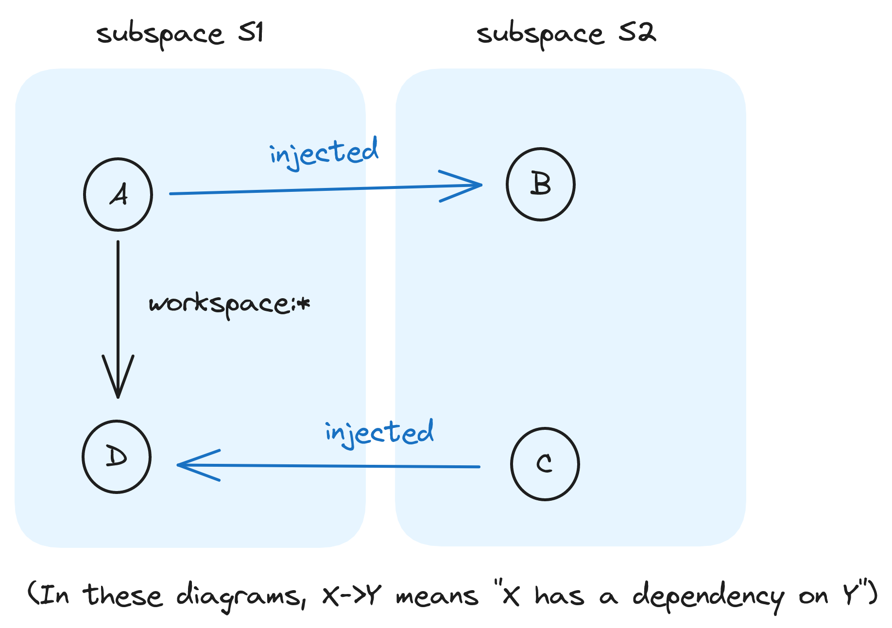

# [RFC #4320](https://github.com/microsoft/rushstack/issues/4230): Rush Subspaces

RFC maintainers: [@chengcyber](https://github.com/chengcyber), [@octogonz](https://github.com/octogonz)

## Motivation

The PNPM package manager provides a **workspace** feature that allows multiple projects to be managed as a group. The workspace is defined by `pnpm-workspace.yaml`, which in a Rush monorepo is generated from `rush.json`. That workspace has a **package lockfile** `pnpm-lock.yaml` that is essentially an installation plan, tracking the installed version of every dependency for your projects.

## More than one lockfile

When projects share a lockfile, the versions of NPM dependencies are centrally coordinated, which mostly involves choosing the right version numbers to avoid problems such as side-by-side versions, doppelgangers, and unsatisfied peer dependencies. For a crash course in these topics, see the [Lockfile Explorer docs](https://lfx.rushstack.io/).

Centrally coordinating lockfiles brings some challenges:

- **Consistency assumption:** In a healthy monorepo, most projects will use a consistent set of toolchains and versions, or at least a small number of such sets (perhaps one set of versions for experimental projects, one for stable projects, etc.). The `.pnpmfile.cjs` override rules can then mostly involve forcing projects to conform to one of those established sets. This assumption does not apply very well for projects whose dependencies wildly different from the rest of the monorepo, such as a project that was developed externally and then moved into the monorepo.
  (This RFC was originally proposed by TikTok, whose monorepo has an abundance of such projects.)

- **Collateral effects:** When someone updates a version and regenerates `pnpm-lock.yaml`, this may affect the version choices for shared dependencies being used by other unrelated projects. Those projects must then be tested, and fixed if a break occurs. (TikTok has many projects that rely primarily on manual testing, which is costly.)

- **Git merge conflicts:** Git pull requests will encounter merge conflicts if multiple PRs have modified the same NPM dependencies in `pnpm-lock.yaml`. If the file is frequently churned, it can become a "mutex" that requires each PR to be built and merged one at a time, greatly reducing parallelization.

- **Unrealistic library tests:** When publishing NPM packages for external consumption, it can be beneficial for a test project to use a real installation of the library project rather than relying on `workspace:*` linking. Using a real installation can reveal bugs such as incorrect `.npmignore` globs, that otherwise would not be discovered until after the release is published. (A prototype of this idea was implemented by the [install-test-workspace project](https://github.com/microsoft/rushstack/tree/main/build-tests/install-test-workspace) in the Rush Stack monorepo, discussed in [pnpm#3510](https://github.com/pnpm/pnpm/issues/3510).)

All of the above problems can be reduced by breaking apart the single centrally coordinated file into multiple decoupled lockfiles; however, doing so creates new problems whose trouble increases according to the number of lockfiles. In the subsequent sections, we'll be contrasting 3 different models:

1. **1 lockfile:** the established convention for PNPM workspaces
2. **700+ lockfiles:** our current "split workspace" fork of Rush, roughly one lockfile per project
3. **20 lockfiles:** this new "subspaces" proposal, roughly one lockfile per team

## Current situation: A split workspace

PNPM supports a feature called **split workspace** enabled via the `.npmrc` setting [shared-workspace-lockfile=false](https://pnpm.io/npmrc#shared-workspace-lockfile). With this model, every project gets its own `pnpm-lock.yaml` file, and `workspace:*` dependencies are installed as symlinks pointing to the corresponding library project folder. Such links are equivalent to what `npm link` would create, and therefore do not correctly satisfy `package.json` dependencies. For that reason PNPM has deprecated this feature. Nonetheless, TikTok has been using it privately via a forked version of Rush tracked by [Rush Stack PR #3481 (split workspace)](https://github.com/microsoft/rushstack/pull/3481). Our fork adapts Rush to support multiple lockfiles while also preserving the usual "common" lockfile, with the goal that over time split lockfiles would be eliminated by eventually migrating all projects into the common lockfile.

> Note that with the "split workspace" feature there is still only one `pnpm-workspace.yaml` file, so this terminology is a bit misleading -- the lockfile is being split, not the workspace file.

The split workspace feature has two major drawbacks:

1. **Not scalable:** We currently have over 700 split lockfiles. Because each lockfile gets installed separately, our total install time is approximately 700x slower than a conventional single-lockfile monorepo. This cost is somewhat hidden in our setup because each CI pipeline only installs a small subset of lockfiles, distributed across hundreds of VMs, one for each pipeline. But even if the runtime cost is acceptable, consuming so many VM resources is not financially acceptable.

2. **Incorrect installation model:** As mentioned, this installation does not correctly satisfy `package.json` version requirements. For example, if `my-app` depends on `react@16.0.0` and `my-library` also depends on `react@16.0.0`, two distinct copies of `react` will be installed in the `node_modules` folder, which we call a **split workspace doppelganger.** This happens because each `pnpm-lock.yaml` is processed essentially as an independent installation. Attempts to fix this problem are equivalent to reverting to a centralized lockfile.

For these reasons, the Rush maintainers have been reluctant to accept **PR #<!---->3481** as an official feature.

## Subspaces (formerly "injected workspaces")

Let's propose a new feature called **subspaces** that divides the workspace into named groups of projects. (In earlier discussions, we called this same feature "injected workspaces.") Each project belongs to exactly one subspace, and each subspace has one lockfile and associated configuration such as `.pnpmfile.cjs`, `common-versions.json`, etc. This can solve both of the problems identified above:

1. **Scalable:** Whereas the split workspace feature introduced one lockfile for every project, subspaces allow splitting conservatively, according to meaningful purposes. For example, we might define one subspace for "bleeding edge projects," one for "testing libraries," and one for "everything else." Or perhaps one subspace per team. A large monrepo could have 20 subspaces but not 700+.

2. **Correct installation model:** When projects belong to separate lockfiles, instead of treating `workspace:*` as a blind `npm link` into a separate universe of versions, subspaces will instead perform an "injected" install. This terminology comes from PNPM's [injected: true](https://pnpm.io/package_json#dependenciesmetainjected) feature. It simulates what would happen if the library project was first published to an NPM registry (for example [Verdaccio](https://verdaccio.org/) on `localhost`) and then installed normally by the dependent project. Rush's `install-test-workspace` project achieves the same result by running `pnpm pack` in the library folder to produce a tarball, then using `.pnpmfile.cjs` to replace `workspace:*` with a `file:` reference to that tarball.

### Observation #1: We need a postbuild event

Whichever way that injected installs are implemented, an important consequence is that the library project gets copied instead of symlinked into the consumer's `node_modules` folder. This fundamentally changes the developer workflow:

A conventional workflow only needs to perform `rush install` once:

```bash
# 1. this will link my-app/node_modules/my-lib --> libraries/my-lib
rush install

# 2. Make some changes to my-lib, which is a dependency of my-app

# 3. Rebuild my-lib and my-app
rush build --to my-app

# 4. everything is now good, repeat from step 2
```

Whenever `my-lib` is modified and rebuilt, `my-app` automatically reflects those changes, because `my-app/node_modules/my-lib` is a symlink pointing to the build outputs. By contrast, with an injected install, step #<!---->1 makes a copy of `libraries/my-lib`, which does not update automatically. In step #<!---->3 we must redo this copy, and copying must occur AFTER `my-lib` is built, but BEFORE `my-app` is built.

How to accomplish that? It implies a new project lifecycle event such as **postbuild** (for `my-lib`) or **prebuild** (for `my-app`).

- **prebuild challenges:** If each project syncs its injected folders before building, then the main problem is change detection. "Building" could mean any operation in that folder, for example any `npm run do-something` command, and such commands can be chained together. Efficient filesystem change detection is very difficult without a live process such as [chokidar](https://www.npmjs.com/package/chokidar) or [watchman](https://facebook.github.io/watchman/), and every such project needs this logic. With PNPM symlinking, two different projects may have an injected `node_modules` subfolder that ends up symlinking to the same final target; in this case, a mutex may be required to prevent two concurrent **prebuild** actions from overwriting each other's outputs.

- **postbuild challenges:** On the other hand, if the library itself updates all of its injected copies after building, then watching is not necessary; it's relatively easy to know when the library has finished building. The mutex problem is also simpler, or avoided entirely if we don't allow concurrent builds in the same folder. The main challenge is registering/unregistering the folders to be updated, since in theory any PNPM workspace could introduce a new injected install relationship, or the project folder might get moved, or abandoned but left on disk.

Our proposal chooses the "postbuild" approach because it seems to be easier to implement and more efficient for Rush's use case, but perhaps ultimately both approaches can be supported.

This is a nontrivial change: PNPM's "injected" feature is not widely used today, for the exact reason that it provides no event for updating the injected copies, and thus is only practical for non-built projects such as plain .js source files without any transformations. The PNPM maintainers perhaps hesitated to introduce such an event as it is unconventional and may break assumptions of existing tools. Rush monorepos are in a better position to adopt such a model, given to our focus on centrally managed monorepos with a more formalized structure.

### Observation #2: Subspace topology is surprisingly flexible

Consider the following diagram:



NPM package dependencies must form a directed graph without cycles, and this determines build order. This suggests that our lockfiles should also avoid cycles: for example, if `S1` depends on `S2` via `A->B` then perhaps we should not allow `S2` to depend on `S1` via `C->D`. Surprisingly, it turns out that this constraint is unnecessary. Injected dependencies are installed as if the tarball was fetched from an NPM registry, and recall that NPM registries store `package.json` files but not lockfiles. In this way each subspace lockfile is essentially a self-contained installation plan that gets generated based on the `package.json` file of the library project, but without ever consulting the other lockfile. Thus, the above diagram poses no problems. The project build order must of course still follow the directed acyclic graph, with the "postbuild" event copying the package contents.

### Observation #3: Which dependencies to inject?

In PNPM's implementation, there is only one lockfile, and `injected: true` is manually configured in `package.json` for specific dependency package names. How should an engineer know when to enable this setting? In other words, when should a `workspace:*` dependency get installed via injecting instead of folder symlinking?

As a clue to this problem, recall that PNPM's installation model has a longstanding limitation that `workspace:*` dependencies do not correctly satisfy peer dependencies, because peer dependencies are satisfied by making copies of the package folder (**peer doppelgangers**). In practice this can usually be mitigated for example by enforcing consistent versions across the monorepo, or by using Webpack aliases to override module resolution, but these mitigations are hacks. The `injected: true` feature originally arose as a correct solution.

Here is the complete list of cases where injected copying is required (assuming we are unwilling to mitigate the problem in some other way):

1. If a local project depends on another local project via `workspace:*` and needs to satisfy a peer dependency (including implicit peer dependencies resulting from transitive dependencies)
2. In our new subspaces proposal, injecting is required wherever a `workspace:*` dependency refers to a project in a separate subspace
3. Even if it is not theoretically required, injecting can be enabled manually for more accurate testing of published libraries (the `install-test-workspace` scenario mentioned earlier)

Note that cases #<!---->1 and #<!---->2 could be automatically inferred -- we don't really need to require engineers to manually configure an `injected: true` setting. In fact it would not be theoretically incorrect to always inject every dependency, except that in practice copying is significantly more expensive than symlinking, and of course it also requires our unconventional "postbuild" lifecycle event.

### Observation #4: Two entirely independent features

Thinking more deeply about that last point, we are proposing two entirely separate features:

1. Multiple lockfiles which are defined using subspaces
2. Injected installation with a "postbuild" lifecycle event to that updates the folder copies under `node_modules`

Each feature could be used by itself:

- **#<!---->1 without #<!---->2:** Subspaces could be used without injected installation, instead handling `workspace:*` by creating simple symlinks as was done with the split workspace feature. This is undesirable because it produces an incorrect solution. But we should implement it, since it will help with migrating from a split workspace, by allowing split lockfiles to be replaced by equivalent subspaces.
- **#<!---->2 without #<!---->1:** Injected installation could be used without subspaces, as exemplified by PNPM's `injected: true` feature. We should support this in the final design, however doing so probably requires designing config files and policies to manage such settings in a large scale problem domain. In order to postpone that work, for our initial implementation we will make a simplifying assumption:

_**Initial implementation:** A dependency will be injected if-and-only-if it is a `workspace:*` reference that refers to a project external to the lockfile/subspace that is being installed._

## Design Details

### Configuring subspaces

Subspaces will be enabled using a new config file `common/config/rush/subspaces.json`, whose format will be:

**common/config/rush/subspaces.json**

```js
{
  "useSubspaces": true,

  // Names must be lowercase and separated by dashes.
  // To avoid mistakes, common/config/subspaces/ subfolder
  // cannot be used unless its name appears in this array.
  "subspaceNames": [ "default", "react19", "install-test" ]
}
```

The lockfile and associated config files for each subspace will be `common/config/subspaces` folder:

```
common/config/subspaces/<subspace-name>/pnpm-lock.yaml
common/config/subspaces/<subspace-name>/.pnpmfile.cjs
common/config/subspaces/<subspace-name>/.npmrc
common/config/subspaces/<subspace-name>/common-versions.json
```

Subspaces will also allow for a global configuration file for npmrc settings to apply for all subspaces. This global configuration file will be located in the common rush directory: `common/config/rush/.npmrc-global`

As noted in the [PR #3481 discussion](https://github.com/microsoft/rushstack/pull/3481#discussion_r901277915), Rush's current strategy of installing directly into `common/temp` makes it difficult to introduce additional PNPM installations without phantom dependency folders. To address this problem, when `useSubspaces=true`, the top-level `common/temp/node_modules` folder will not be created at all. Instead, lockfiles will get installed to subfolders with the naming pattern `common/temp/subspaces/<subspace-name>/`.

Rush projects will be mapped to a subspace using a new project-specific field in rush.json:

**rush.json**

```js
"projects": [
  "my-project": {
    "packageName": "@acme/my-project",
    "projectFolder": "apps/my-project",
    "subspace": "react18"
  }
]
```

If the `"subspaceNames"` array in **subspaces.json** includes the name `"default"`, then the `"subspace"` field can be omitted for **rush.json** projects; in that case the project will be mapped to the default subspace.

### The pnpm-sync command

We propose to introduce a new command line tool called `pnpm-sync` that should be invoked for any library projects that have been installed as an injected dependency. Doing so updates the installed copies of this library's outputs. This command should be invoked whenever the library project has been rebuilt in any way, at the end of that operation, and before building any dependent projects. The command is so-named because we eventually hope to contribute it back to the PNPM project as a package manager feature, rather than making it a Rush-specific tool.

In a vanilla PNPM workspace, we could introduce `"postbuild"` as an actual [NPM lifecycle event](https://docs.npmjs.com/cli/v6/using-npm/scripts) to invoke `pnpm-sync`:

**package.json**

```js
{
  "name": "my-library",
  "version": "1.0.0",
  "scripts": {
    "build": "heft build --clean",
    "postbuild": "pnpm-sync"
  }
  . . .
```

In a Rush monorepo, it is probably better invoked via a dedicated [Rush phase](https://rushjs.io/pages/maintainer/phased_builds/).

The `pnpm-sync` command will perform the following operations:

1. Look for a machine-generated file `<project-folder>/node_modules/.pnpm-sync.json` which contains an inventory of injected folders to be updated. In our initial implementation, this file will get generated by `rush install` or `rush update`. Later, `pnpm install` will manage it natively.
2. Calculate the list of files to be copied, using the same logic as `pnpm pack` which consults the [.npmignore](https://docs.npmjs.com/cli/v7/using-npm/developers#keeping-files-out-of-your-package) file and/or `files` field of **package.json**.
3. Copy those files into each target folder.

Here's a suggested format for `.pnpm-sync.json`:

**&lt;project-folder&gt;/node_modules/.pnpm-sync.json**

```js
{
  "postbuildInjectedCopy": {
    /**
     * The project folder to be copied, relative to the folder containing ".pnpm-sync.json".
     * The "pnpm-sync" command will look for package.json and .npmignore in this folder
     * and apply the same filtering as "pnpm pack".
     */
    "sourceFolder": "../..",

    "targetFolders": [
      {
        /**
         * The target path containing an injected copy that "pnpm-sync" should update.
         * This path is relative to the folder containing pnpm-sync.json, and typically
         * should point into the physical ".pnpm" subfolder for a given PNPM lockfile.
         */
        "folderPath": "../../node_modules/.pnpm/file+..+shared+my-library/node_modules/my-library"
      },
      {
        // Here's an example for a hypothetical peer doppelganger of our "my-library"
        "folderPath": "../../node_modules/.pnpm/file+..+shared+my-library_react@16.14.0/node_modules/my-library"
      }
    ]
  }
}
```

### rush-inject-workspace-prototype repository

[@chengcyber](https://github.com/chengcyber) has created this repository to help with studying `pnpm-sync` folder structures:

https://github.com/chengcyber/rush-inject-workspace-prototype

It illustrates how two PNPM workspaces could be configured to automatically perform injection for cross-space dependencies, by using `.pnpmfile.cjs` to automatically rewrite `workspace:*` to links to `file:` links, similar to the approach of his **PR #<!---->3481**. It also illustrates how this might be adapted to a Rush feature. He found that PNPM 6 has different handling of `file:` from later versions of PNPM.

## Interaction with other Rush features

Our experience with [Rush Stack PR #3481 (split workspace)](https://github.com/microsoft/rushstack/pull/3481) found that operational changes to `pnpm install` have relatively little impact on other Rush features. For example:

- The `rush build` cache works with **PR #<!---->3481** and correctly calculates cache keys based on `node_modules` dependencies.
- `rush publish` does some rewriting of `workspace:*` dependencies, but he heuristic that it uses does not seem to assume that the referenced project is really in the same **pnpm-workspace.yaml** file.
- `rush deploy` should work essentially the with injected installations for subspaces, since the underlying [@rushstack/package-extractor](https://github.com/microsoft/rushstack/tree/main/libraries/package-extractor) engine is driven by Node.js module resolution, and is largely independent of how those `node_modules` folders or symlinks were created.
- **PR #<!---->3481** integrated with Rush [project selectors](https://rushjs.io/pages/developer/selecting_subsets/), for example `rush list --only split:true`. For subspaces, we can implement something similar, for example `rush list --only space:my-subspace-name`.

**PR #<!---->3481** did not attempt to apply Rush policies to projects with split lockfile; policies only applied to the so-called "common" lockfile. Generalizing these policies across subspaces will be nontrivial work, so we've proposed to implement that as a secondary stage of work.
