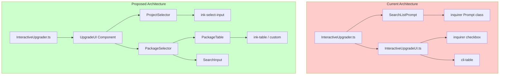

# InteractiveUpgradeUI Terminal Library Rewrite

| Document Metadata      | Details                                                                        |
| ---------------------- | ------------------------------------------------------------------------------ |
| Author(s)              | Sean Larkin                                                                    |
| Status                 | Draft (WIP)                                                                    |
| Team / Owner           | Rush Stack Team                                                                |
| Created / Last Updated | 2026-01-23                                                                     |

## 1. Executive Summary

This RFC proposes replacing the current `InteractiveUpgradeUI` implementation in `@microsoft/rush-lib` with a modern terminal UI library. Currently, the system uses **inquirer** (v8.2.7) with **cli-table** (v0.3.1) to render package upgrade selections. The existing implementation has several limitations: inquirer's RxJS-based architecture makes customization difficult, the code requires manual table rendering hacks to align content, and the user experience lacks modern affordances like real-time search filtering. The proposed solution will adopt **Ink** (React-based terminal UI) to provide a maintainable, component-based architecture while delivering an improved user experience with smoother interactions, better accessibility, and extensibility for future Rush CLI improvements.

## 2. Context and Motivation

### 2.1 Current State

The `InteractiveUpgradeUI` module (`libraries/rush-lib/src/utilities/InteractiveUpgradeUI.ts`) provides an interactive dependency upgrade experience for `rush upgrade-interactive`. It currently uses:

| Dependency | Version | Purpose |
|------------|---------|---------|
| `inquirer` | ~8.2.7 | Prompt framework (checkbox selection) |
| `cli-table` | ~0.3.1 | ASCII table rendering |
| `figures` | 3.0.0 | Unicode symbols |
| `rxjs` | ~6.6.7 | Event streams (inquirer dependency) |

**Architecture:**

```
┌─────────────────────────────────────────────────────────────────────┐
│                    InteractiveUpgrader.ts                           │
│  - Project selection via SearchListPrompt (inquirer)                │
│  - Calls NpmCheck to get dependency status                          │
│  - Calls upgradeInteractive() for package selection                 │
└───────────────────────────┬─────────────────────────────────────────┘
                            │
                            ▼
┌─────────────────────────────────────────────────────────────────────┐
│                    InteractiveUpgradeUI.ts                          │
│  - Groups packages by upgrade type (patch/minor/major/etc.)         │
│  - Uses cli-table to format columns                                 │
│  - Renders inquirer checkbox prompt                                 │
│  - Manual string manipulation to align table rows with choices      │
└─────────────────────────────────────────────────────────────────────┘
```

**Limitations:**

1. **Difficult to extend**: Adding new features requires understanding inquirer's RxJS internals
2. **Manual layout hacks**: The code manually splits cli-table output and reassigns to choice names (lines 169-181)
3. **No real-time filtering**: Unlike the `SearchListPrompt`, the checkbox UI lacks search/filter capability
4. **Fixed column widths**: Hard-coded `colWidths: [50, 10, 3, 10, 100]` doesn't adapt to terminal size
5. **Limited accessibility**: No screen reader support, no vim keybindings
6. **Slow load time**: inquirer takes ~120ms to load due to RxJS dependency tree

**Code Reference**: `libraries/rush-lib/src/utilities/InteractiveUpgradeUI.ts:148-181`
```typescript
const cliTable: CliTable = new CliTable({
  chars: { /* all empty to remove borders */ },
  colWidths: [50, 10, 3, 10, 100]  // Hard-coded widths
});

// Manual hack: split table output and reassign to choices
const choicesAsATable: string[] = cliTable.toString().split('\n');
for (let i = 0; i < choices.length; i++) {
  if (typeof choice === 'object' && 'name' in choice) {
    choice.name = choicesAsATable[i];  // Replace array with string
  }
}
```

### 2.2 The Problem

- **Developer Impact:** The existing code is brittle and difficult to modify. The `SearchListPrompt.ts` (265 lines) demonstrates the complexity required to add basic filtering to inquirer prompts, requiring deep knowledge of inquirer internals, RxJS operators, and the Paginator class.

- **User Impact:** The upgrade experience lacks modern affordances:
  - No search/filter in the checkbox list (must scroll through all packages)
  - No group collapse/expand
  - No preview of what will change
  - No keyboard shortcuts for select all/none

- **Technical Debt:** The codebase maintains two different prompt implementations (`SearchListPrompt` for project selection, inquirer's built-in checkbox for package selection), creating inconsistent patterns.

## 3. Goals and Non-Goals

### 3.1 Functional Goals

- [ ] Replace inquirer + cli-table with a modern terminal UI library
- [ ] Maintain feature parity with current implementation:
  - [ ] Group packages by update type (mismatch, missing, patch, minor, major, non-semver)
  - [ ] Multi-select checkbox functionality
  - [ ] Display package name, current version, target version, and homepage
  - [ ] Color coding by update type (green/yellow/red/magenta)
- [ ] Add new capabilities:
  - [ ] Real-time search/filtering of packages
  - [ ] Responsive column widths based on terminal size
  - [ ] Keyboard shortcuts (select all, clear all, toggle group)
  - [ ] Improved accessibility (screen reader support)
- [ ] Reduce complexity and improve maintainability
- [ ] Support both the `InteractiveUpgradeUI` and potentially consolidate `SearchListPrompt`

### 3.2 Non-Goals (Out of Scope)

- [ ] We will NOT change the underlying `NpmCheck` dependency analysis
- [ ] We will NOT modify the `rush upgrade-interactive` command interface
- [ ] We will NOT support terminal-based GUIs (no mouse interaction required)
- [ ] We will NOT replace ALL inquirer usage in rush-lib immediately (phased approach)
- [ ] We will NOT build a custom terminal UI framework from scratch

## 4. Proposed Solution (High-Level Design)

### 4.1 Recommended Library: Ink

After evaluating multiple terminal UI libraries, **Ink** is the recommended choice:

| Library | Weekly Downloads | Stars | TypeScript | Tables | Checkboxes | Search | Active |
|---------|-----------------|-------|------------|--------|------------|--------|--------|
| **Ink** | 2.1M | 33k | Built-in | Via `ink-table` | Via `ink-ui` | Via `ink-quicksearch` | Yes |
| Blessed | 1.2M | 11k | @types | Native | Native | Native | **No** |
| Terminal-kit | 70-200k | 3.3k | @types | Native | Partial | Native | Yes |
| Prompts | 5.7M | 9.2k | Built-in | No | Native | Native | Slow |
| Clack | 3k+ deps | 7.3k | Built-in | No | Native | v1.0+ | Yes |

**Why Ink:**

1. **React-based architecture**: Familiar component model, hooks for state management
2. **Flexbox layouts**: Responsive layouts via Yoga engine
3. **Rich ecosystem**: `ink-table`, `ink-spinner`, `ink-select-input`, `ink-text-input`
4. **Notable adopters**: Gatsby, Prisma, Shopify CLI, GitHub Copilot CLI, Jest (evaluating)
5. **Active development**: Latest version 6.6.0, updated monthly
6. **Built-in TypeScript**: No additional @types packages needed
7. **Testable**: Components can be tested with React Testing Library patterns

**Alternatives Considered:**

| Option | Pros | Cons | Reason for Rejection |
|--------|------|------|---------------------|
| **Clack** | Beautiful, 80% smaller, 100% TypeScript | No table support, limited component flexibility | Lacks table rendering capability needed for package list |
| **Prompts** | Lightweight, 5.7M downloads | No tables, maintenance slowing | Similar limitations to Clack |
| **Terminal-kit** | Full-featured, native tables | Less community adoption, callback-based API | API style doesn't match Rush codebase patterns |
| **@inquirer/prompts** | Stay in inquirer ecosystem | Still no native table support | Would require similar hacks as current implementation |

### 4.2 System Architecture Diagram



### 4.3 Key Components

The component hierarchy follows the React prototype design:

```
TerminalUpgrade (root)
├── TitleBar
├── ControlBar
│   ├── Command prompt label
│   ├── TextInput (search)
│   ├── Legend (filter symbols)
│   └── Selection counter + clear
├── CategoryColumn (×3: minor, major, nonSemver)
│   ├── Category header
│   └── PackageCard (×N)
├── ActionBar
│   ├── Keyboard shortcuts
│   └── Cancel/Upgrade buttons
└── SuccessMessage (conditional)
```

| Component | Responsibility | Technology | Justification |
|-----------|---------------|------------|---------------|
| `TerminalUpgrade` | Root component, all state management | Ink + React hooks | Single source of truth for selection/filter state |
| `TitleBar` | Terminal window title with decorations | Custom Ink Box | Visual terminal framing (`>_ rush upgrade-interactive`) |
| `ControlBar` | Search input, legend, selection counter | Ink Box + `ink-text-input` | Filtering and status display in compact row |
| `CategoryColumn` | Container for one update category | Custom Ink Box | Groups packages by type (minor/major/nonSemver) |
| `PackageCard` | Individual selectable package card | Custom Ink Box | Displays checkbox, name, version transition |
| `ActionBar` | Keyboard hints and action buttons | Custom Ink Box | Cancel/Upgrade buttons with shortcut reference |
| `SuccessMessage` | Post-upgrade confirmation | Custom Ink Box | Animated feedback after successful upgrade |

## 5. Detailed Design

### 5.1 API Interface

The external API remains unchanged to maintain backwards compatibility:

```typescript
// Existing interface - NO CHANGES
export interface IDepsToUpgradeAnswers {
  packages: INpmCheckPackageSummary[];
}

// Existing function signature - NO CHANGES
export async function upgradeInteractive(
  pkgs: INpmCheckPackageSummary[]
): Promise<IDepsToUpgradeAnswers>;
```

### 5.2 Component Structure

The implementation follows the React component hierarchy from the design prototype. The root `TerminalUpgrade` component manages all state and renders a terminal-styled window frame.

```typescript
// Type definitions

type UpdateCategory = 'minor' | 'major' | 'nonSemver';

interface IPackage {
  id: string;
  name: string;
  currentVersion: string;
  newVersion: string;
  category: UpdateCategory;
  url: string;
  description?: string;
}

interface ICategoryInfo {
  label: string;
  description: string;
  symbol: string;
  color: string;
}

// Category metadata helper
const getCategoryInfo = (category: UpdateCategory): ICategoryInfo => {
  switch (category) {
    case 'minor':
      return {
        label: 'Minor Update',
        description: 'New backwards-compatible features',
        symbol: '●',
        color: 'cyan'
      };
    case 'major':
      return {
        label: 'Major Update',
        description: 'Potentially breaking API changes. Use caution.',
        symbol: '▲',
        color: 'yellow'
      };
    case 'nonSemver':
      return {
        label: 'Non-Semver Versions',
        description: 'Less than 1.0.0, caution.',
        symbol: '■',
        color: 'magenta'
      };
  }
};
```

**Root Component:**

```typescript
interface ITerminalUpgradeProps {
  packages: IPackage[];
  onSubmit: (selected: IPackage[]) => void;
  onCancel: () => void;
}

const TerminalUpgrade: React.FC<ITerminalUpgradeProps> = ({ packages, onSubmit, onCancel }) => {
  const [selectedPackages, setSelectedPackages] = useState<Set<string>>(new Set());
  const [searchTerm, setSearchTerm] = useState<string>('');
  const [focusedPackageId, setFocusedPackageId] = useState<string | null>(null);
  const [showSuccess, setShowSuccess] = useState<boolean>(false);

  // Toggle individual package selection
  const togglePackage = (id: string) => {
    const newSelected = new Set(selectedPackages);
    if (newSelected.has(id)) {
      newSelected.delete(id);
    } else {
      newSelected.add(id);
    }
    setSelectedPackages(newSelected);
  };

  // Select all packages in a category
  const selectAllInCategory = (category: UpdateCategory) => {
    const newSelected = new Set(selectedPackages);
    packages
      .filter((pkg) => pkg.category === category)
      .forEach((pkg) => newSelected.add(pkg.id));
    setSelectedPackages(newSelected);
  };

  // Clear all selections
  const clearSelection = () => setSelectedPackages(new Set());

  // Handle upgrade action
  const handleUpgrade = () => {
    const selected = packages.filter((pkg) => selectedPackages.has(pkg.id));
    onSubmit(selected);
    setShowSuccess(true);
  };

  // Filter packages by search term
  const filteredPackages = packages.filter((pkg) =>
    pkg.name.toLowerCase().includes(searchTerm.toLowerCase())
  );

  // Group filtered packages by category
  const groupedPackages = filteredPackages.reduce((acc, pkg) => {
    if (!acc[pkg.category]) {
      acc[pkg.category] = [];
    }
    acc[pkg.category].push(pkg);
    return acc;
  }, {} as Record<UpdateCategory, IPackage[]>);

  // Keyboard input handling
  useInput((input, key) => {
    if (key.return) {
      handleUpgrade();
    } else if (key.escape) {
      onCancel();
    } else if (input === ' ') {
      if (focusedPackageId) {
        togglePackage(focusedPackageId);
      }
    }
    // Arrow key navigation handled by focus management
  });

  return (
    <Box flexDirection="column" borderStyle="single" borderColor="green">
      {/* Terminal Title Bar */}
      <TitleBar title="rush upgrade-interactive" />

      {/* Control Bar */}
      <ControlBar
        searchTerm={searchTerm}
        onSearchChange={setSearchTerm}
        selectedCount={selectedPackages.size}
        onClear={clearSelection}
      />

      {/* Package Columns */}
      <Box flexDirection="row" paddingX={1} paddingY={1}>
        {(['minor', 'major', 'nonSemver'] as UpdateCategory[]).map((category) => {
          const categoryPackages = groupedPackages[category] || [];
          const selectedInCategory = categoryPackages.filter((pkg) =>
            selectedPackages.has(pkg.id)
          ).length;

          return (
            <CategoryColumn
              key={category}
              category={category}
              packages={categoryPackages}
              selectedCount={selectedInCategory}
              selectedPackages={selectedPackages}
              focusedPackageId={focusedPackageId}
              onToggle={togglePackage}
              onSelectAll={() => selectAllInCategory(category)}
              onFocus={setFocusedPackageId}
            />
          );
        })}
      </Box>

      {/* Action Bar */}
      <ActionBar
        selectedCount={selectedPackages.size}
        onCancel={onCancel}
        onUpgrade={handleUpgrade}
      />

      {/* Success Message */}
      {showSuccess && (
        <SuccessMessage count={selectedPackages.size} />
      )}
    </Box>
  );
};
```

**Sub-Components:**

```typescript
// Terminal Title Bar
const TitleBar: React.FC<{ title: string }> = ({ title }) => (
  <Box backgroundColor="green" paddingX={1}>
    <Text color="black" bold>
      >_ {title}
    </Text>
    <Box flexGrow={1} />
    <Text color="black">□ ─ ×</Text>
  </Box>
);

// Control Bar with search, legend, and selection counter
const ControlBar: React.FC<{
  searchTerm: string;
  onSearchChange: (term: string) => void;
  selectedCount: number;
  onClear: () => void;
}> = ({ searchTerm, onSearchChange, selectedCount, onClear }) => (
  <Box paddingX={1} paddingY={1} borderStyle="single" borderColor="gray">
    {/* Command prompt */}
    <Text color="green">$ </Text>
    <Text dimColor>upgrade-interactive</Text>

    {/* Search input */}
    <Box marginLeft={2} borderStyle="single" borderColor="green" paddingX={1}>
      <Text color="green">› </Text>
      <TextInput
        placeholder="search..."
        value={searchTerm}
        onChange={onSearchChange}
      />
    </Box>

    {/* Legend */}
    <Box marginLeft={2}>
      <Text color="cyan">● minor  </Text>
      <Text color="yellow">▲ major  </Text>
      <Text color="magenta">■ non-semver</Text>
    </Box>

    {/* Selection counter */}
    <Box flexGrow={1} />
    <Text dimColor>Selected: </Text>
    <Text color="green" bold>{selectedCount}</Text>
    {selectedCount > 0 && (
      <Text color="red" dimColor> [clear]</Text>
    )}
  </Box>
);

// Category Column containing header and package cards
const CategoryColumn: React.FC<{
  category: UpdateCategory;
  packages: IPackage[];
  selectedCount: number;
  selectedPackages: Set<string>;
  focusedPackageId: string | null;
  onToggle: (id: string) => void;
  onSelectAll: () => void;
  onFocus: (id: string | null) => void;
}> = ({ category, packages, selectedCount, selectedPackages, focusedPackageId, onToggle, onSelectAll, onFocus }) => {
  const info = getCategoryInfo(category);

  return (
    <Box flexDirection="column" borderStyle="single" borderColor="gray" marginRight={1}>
      {/* Category Header */}
      <Box backgroundColor="gray" paddingX={1}>
        <Text color={info.color}>{info.symbol} </Text>
        <Text bold>{info.label} </Text>
        <Text dimColor>[{selectedCount}/{packages.length}] </Text>
        <Text color="green" underline>all</Text>
      </Box>

      {/* Package Cards - Horizontal Layout */}
      <Box flexDirection="row" padding={1}>
        {packages.map((pkg) => (
          <PackageCard
            key={pkg.id}
            pkg={pkg}
            isSelected={selectedPackages.has(pkg.id)}
            isFocused={focusedPackageId === pkg.id}
            onToggle={() => onToggle(pkg.id)}
            onFocus={() => onFocus(pkg.id)}
            onBlur={() => onFocus(null)}
          />
        ))}
      </Box>
    </Box>
  );
};

// Individual Package Card
const PackageCard: React.FC<{
  pkg: IPackage;
  isSelected: boolean;
  isFocused: boolean;
  onToggle: () => void;
  onFocus: () => void;
  onBlur: () => void;
}> = ({ pkg, isSelected, isFocused, onToggle, onFocus, onBlur }) => (
  <Box
    borderStyle="single"
    borderColor={isSelected ? 'green' : isFocused ? 'cyan' : 'gray'}
    backgroundColor={isSelected ? 'greenBright' : undefined}
    paddingX={1}
    marginRight={1}
  >
    {/* Checkbox */}
    <Text color={isSelected ? 'green' : 'gray'}>
      {isSelected ? '[●]' : '[○]'}
    </Text>

    {/* Package name and versions */}
    <Text color="cyan" bold> {pkg.name} </Text>
    <Text dimColor>{pkg.currentVersion}</Text>
    <Text dimColor> → </Text>
    <Text color="green">{pkg.newVersion}</Text>
  </Box>
);

// Action Bar with keyboard hints and buttons
const ActionBar: React.FC<{
  selectedCount: number;
  onCancel: () => void;
  onUpgrade: () => void;
}> = ({ selectedCount, onCancel, onUpgrade }) => (
  <Box borderStyle="single" borderColor="green" paddingX={1} paddingY={1}>
    {/* Keyboard shortcuts */}
    <Box>
      <Text inverse color="green"> SPACE </Text>
      <Text dimColor> select  </Text>
      <Text dimColor>│ </Text>
      <Text inverse color="green"> ENTER </Text>
      <Text dimColor> upgrade  </Text>
      <Text dimColor>│ </Text>
      <Text inverse color="green"> ESC </Text>
      <Text dimColor> cancel</Text>
    </Box>

    <Box flexGrow={1} />

    {/* Action buttons */}
    <Box>
      <Box borderStyle="single" borderColor="gray" paddingX={1} marginRight={1}>
        <Text dimColor>Cancel</Text>
      </Box>
      <Box
        borderStyle="single"
        borderColor={selectedCount > 0 ? 'green' : 'gray'}
        backgroundColor={selectedCount > 0 ? 'green' : undefined}
        paddingX={1}
      >
        <Text color={selectedCount > 0 ? 'black' : 'gray'} bold>
          Upgrade{selectedCount > 0 ? ` (${selectedCount})` : ''}
        </Text>
      </Box>
    </Box>
  </Box>
);

// Success message displayed after upgrade
const SuccessMessage: React.FC<{ count: number }> = ({ count }) => (
  <Box borderStyle="single" borderColor="green" paddingX={1} marginTop={1}>
    <Text color="green">✓ </Text>
    <Text color="green" bold>
      Upgraded {count} package{count !== 1 ? 's' : ''}
    </Text>
  </Box>
);
```

### 5.3 UI Layout

The UI uses a **horizontal multi-column layout** with filter controls at the top, enabling users to quickly scan and select packages across different update categories simultaneously.

```
┌─────────────────────────────────────────────────────────────────────────────────────────┐
│ >_ rush upgrade-interactive                                                      □  ─  × │
├─────────────────────────────────────────────────────────────────────────────────────────┤
│ $ upgrade-interactive   > search...           ● minor  ▲ major  ■ non-semver  Selected: 0│
├─────────────────────────────────────────────────────────────────────────────────────────┤
│                                                                                         │
│  ● Minor Update [0/2] all       ▲ Major Update [0/1] all       ■ Non-Semver Versions [0/2] all │
│  ┌─────────────────────────┐    ┌─────────────────────────┐    ┌─────────────────────────┐│
│  │ [○] tslib 2.3.1 → 2.8.1 │    │ [○] react 17.0.1 → 19.2.3│    │ [○] @swc/helpers        ││
│  └─────────────────────────┘    └─────────────────────────┘    │     0.5.12 → 0.5.18     ││
│  ┌─────────────────────────┐                                   └─────────────────────────┘│
│  │ [○] eslint_devDep       │                                                             │
│  │     9.17.0 → 9.39.2     │                                                             │
│  └─────────────────────────┘                                                             │
│                                                                                         │
├─────────────────────────────────────────────────────────────────────────────────────────┤
│ SPACE select  │  ENTER upgrade  │  ESC cancel                        [ Cancel ] [Upgrade]│
└─────────────────────────────────────────────────────────────────────────────────────────┘
```

**Layout Breakdown:**

| Section | Description |
|---------|-------------|
| **Header Bar** | Command name display with window controls |
| **Control Bar** | Search input, filter toggles (minor/major/non-semver), selection counter |
| **Package Columns** | Three horizontal columns for each update category with selection count and "all" link |
| **Package Cards** | Individual selectable cards showing checkbox, package name, and version transition |
| **Action Bar** | Keyboard shortcuts on left, Cancel/Upgrade buttons on right |

**Visual Elements:**

| Element | Unicode Symbol | ASCII Fallback | Color | No-Color Fallback | Meaning |
|---------|----------------|----------------|-------|-------------------|---------|
| Minor Update | ● | * | Cyan | `[minor]` | Backwards-compatible features |
| Major Update | ▲ | ^ | Yellow | `[MAJOR]` | Potentially breaking changes |
| Non-Semver | ■ | # | Magenta | `[other]` | Version constraints outside semver |
| Unselected | [○] | [ ] | Gray | `[ ]` | Package not selected for upgrade |
| Selected | [●] | [x] | Green | `[x]` | Package selected for upgrade |
| Focused | `>>` | `>>` | Cyan | `>>` | Currently focused item |
| Arrow | → | -> | - | `->` | Version transition indicator |

**Keyboard Controls:**

| Key | Action | Notes |
|-----|--------|-------|
| `SPACE` | Toggle selection of focused package | Primary selection mechanism |
| `ENTER` | Confirm and apply selected upgrades | Exits UI and applies changes |
| `ESC` | Cancel and exit without changes | Also exits search mode |
| `↑` / `k` | Navigate up within column | Vim-style `k` for power users |
| `↓` / `j` | Navigate down within column | Vim-style `j` for power users |
| `←` / `h` | Navigate to previous column | Vim-style `h` for power users |
| `→` / `l` | Navigate to next column | Vim-style `l` for power users |
| `Tab` | Move focus to next section | Cycles: columns → search → buttons |
| `Shift+Tab` | Move focus to previous section | Reverse cycle |
| `/` | Focus search input | Type to filter packages |
| `a` | Select all in current column | Quick bulk selection |
| `A` | Select all packages | Global select |
| `n` | Deselect all in current column | Quick bulk deselection |
| `N` | Deselect all packages | Global deselect |
| `1` / `2` / `3` | Jump to column 1/2/3 | Quick column navigation |
| `g` | Go to first package | Jump to top |
| `G` | Go to last package | Jump to bottom |
| `?` | Toggle help overlay | Shows keyboard shortcuts |

### 5.4 State Management

State is managed using React hooks at the root `TerminalUpgrade` component level. The design uses a flat state model for simplicity, as the component hierarchy is relatively shallow.

```typescript
interface IUpgradeUIState {
  // Selection state - Set of package IDs that are selected
  selectedPackages: Set<string>;

  // Search/filter state
  searchTerm: string;

  // Focus state for keyboard navigation
  focusedPackageId: string | null;

  // UI feedback state
  showSuccess: boolean;
}

// Initial state
const initialState: IUpgradeUIState = {
  selectedPackages: new Set(),
  searchTerm: '',
  focusedPackageId: null,
  showSuccess: false
};
```

**State Operations:**

| Operation | Description | Implementation |
|-----------|-------------|----------------|
| `togglePackage(id)` | Toggle selection of a single package | Add/remove from `selectedPackages` Set |
| `selectAllInCategory(category)` | Select all packages in a category | Filter by category, add all to Set |
| `clearSelection()` | Clear all selections | Reset to empty Set |
| `setSearchTerm(term)` | Update search filter | Set `searchTerm` state |
| `setFocusedPackageId(id)` | Track keyboard focus | Set `focusedPackageId` state |

**Derived State (computed via `useMemo`):**

```typescript
// Filter packages by search term
const filteredPackages = useMemo(() =>
  packages.filter((pkg) =>
    pkg.name.toLowerCase().includes(searchTerm.toLowerCase())
  ),
  [packages, searchTerm]
);

// Group filtered packages by category for column rendering
const groupedPackages = useMemo(() =>
  filteredPackages.reduce((acc, pkg) => {
    if (!acc[pkg.category]) {
      acc[pkg.category] = [];
    }
    acc[pkg.category].push(pkg);
    return acc;
  }, {} as Record<UpdateCategory, IPackage[]>),
  [filteredPackages]
);

// Count selected packages per category (for header display)
const selectedCountByCategory = useMemo(() => ({
  minor: groupedPackages.minor?.filter(p => selectedPackages.has(p.id)).length ?? 0,
  major: groupedPackages.major?.filter(p => selectedPackages.has(p.id)).length ?? 0,
  nonSemver: groupedPackages.nonSemver?.filter(p => selectedPackages.has(p.id)).length ?? 0
}), [groupedPackages, selectedPackages]);
```

**Keyboard Navigation State Machine:**

```
                    ┌─────────────────────────────────────────┐
                    │              IDLE                        │
                    │  focusedPackageId = null                 │
                    └─────────────────┬───────────────────────┘
                                      │ Arrow key / Tab
                                      ▼
                    ┌─────────────────────────────────────────┐
                    │           NAVIGATING                     │
                    │  focusedPackageId = <package-id>         │
                    │  ← → moves between columns               │
                    │  ↑ ↓ moves within column                 │
                    └─────────────────┬───────────────────────┘
                                      │ SPACE
                                      ▼
                    ┌─────────────────────────────────────────┐
                    │     TOGGLE (returns to NAVIGATING)       │
                    │  selectedPackages.toggle(focusedId)      │
                    └─────────────────────────────────────────┘
```

### 5.5 Terminal Compatibility & Graceful Degradation

Since this is a Terminal UI (TUI), we must handle varying terminal capabilities gracefully. The implementation uses progressive enhancement: rich features for capable terminals, sensible fallbacks for limited ones.

#### 5.5.1 Terminal Capability Detection

```typescript
interface ITerminalCapabilities {
  // Display capabilities
  supportsColor: boolean;        // ANSI color codes
  colorDepth: 1 | 4 | 8 | 24;    // 1=mono, 4=16color, 8=256color, 24=truecolor
  supportsUnicode: boolean;      // Unicode box-drawing, symbols
  supportsBold: boolean;         // Bold/dim text
  supportsUnderline: boolean;    // Underline text

  // Interaction capabilities
  isInteractive: boolean;        // TTY with stdin
  supportsMouse: boolean;        // Mouse click events
  supportsAlternateScreen: boolean; // Alternate screen buffer

  // Size
  columns: number;
  rows: number;
}

// Detection logic
function detectCapabilities(): ITerminalCapabilities {
  const isTTY = process.stdout.isTTY ?? false;
  const colorSupport = supportsColor.stdout;

  return {
    supportsColor: colorSupport !== false,
    colorDepth: colorSupport ? (colorSupport.has16m ? 24 : colorSupport.has256 ? 8 : 4) : 1,
    supportsUnicode: detectUnicodeSupport(),
    supportsBold: isTTY,
    supportsUnderline: isTTY,
    isInteractive: isTTY && process.stdin.isTTY,
    supportsMouse: isTTY && process.env.TERM !== 'dumb',
    supportsAlternateScreen: isTTY && !process.env.CI,
    columns: process.stdout.columns || 80,
    rows: process.stdout.rows || 24
  };
}

function detectUnicodeSupport(): boolean {
  // Check common indicators of Unicode support
  const lang = process.env.LANG || process.env.LC_ALL || '';
  const term = process.env.TERM || '';

  if (lang.toLowerCase().includes('utf')) return true;
  if (term.includes('xterm') || term.includes('256color')) return true;
  if (process.platform === 'win32') {
    // Windows Terminal and modern consoles support Unicode
    return !!process.env.WT_SESSION || !!process.env.TERM_PROGRAM;
  }
  return false;
}
```

#### 5.5.2 Rendering Mode Tiers

| Tier | Description | When Used | Features |
|------|-------------|-----------|----------|
| **Rich** | Full TUI experience | Modern terminals (Windows Terminal, iTerm2, VS Code) | Unicode symbols, 256/truecolor, box-drawing, mouse support |
| **Standard** | Reduced visuals | Basic TTY with color | ASCII symbols, 16 colors, simple borders |
| **Basic** | Minimal formatting | Dumb terminals, no color | Plain text, no colors, `+--+` borders |
| **Non-Interactive** | Static output | CI/CD, piped output | List format, no interaction, exit with error |

```typescript
type RenderingTier = 'rich' | 'standard' | 'basic' | 'non-interactive';

function determineRenderingTier(caps: ITerminalCapabilities): RenderingTier {
  if (!caps.isInteractive) return 'non-interactive';
  if (!caps.supportsColor) return 'basic';
  if (!caps.supportsUnicode || caps.colorDepth < 8) return 'standard';
  return 'rich';
}
```

#### 5.5.3 Symbol Sets by Tier

```typescript
interface ISymbolSet {
  bullet: { minor: string; major: string; nonSemver: string };
  checkbox: { checked: string; unchecked: string };
  focus: string;
  arrow: string;
  border: {
    topLeft: string; topRight: string;
    bottomLeft: string; bottomRight: string;
    horizontal: string; vertical: string;
  };
}

const SYMBOL_SETS: Record<RenderingTier, ISymbolSet> = {
  rich: {
    bullet: { minor: '●', major: '▲', nonSemver: '■' },
    checkbox: { checked: '[●]', unchecked: '[○]' },
    focus: '❯',
    arrow: '→',
    border: { topLeft: '┌', topRight: '┐', bottomLeft: '└', bottomRight: '┘', horizontal: '─', vertical: '│' }
  },
  standard: {
    bullet: { minor: '*', major: '^', nonSemver: '#' },
    checkbox: { checked: '[x]', unchecked: '[ ]' },
    focus: '>',
    arrow: '->',
    border: { topLeft: '+', topRight: '+', bottomLeft: '+', bottomRight: '+', horizontal: '-', vertical: '|' }
  },
  basic: {
    bullet: { minor: '*', major: '^', nonSemver: '#' },
    checkbox: { checked: '[x]', unchecked: '[ ]' },
    focus: '>',
    arrow: '->',
    border: { topLeft: '+', topRight: '+', bottomLeft: '+', bottomRight: '+', horizontal: '-', vertical: '|' }
  },
  'non-interactive': {
    // Not used for rendering, but defined for completeness
    bullet: { minor: '[minor]', major: '[MAJOR]', nonSemver: '[other]' },
    checkbox: { checked: '[x]', unchecked: '[ ]' },
    focus: '>>',
    arrow: '->',
    border: { topLeft: '', topRight: '', bottomLeft: '', bottomRight: '', horizontal: '', vertical: '' }
  }
};
```

#### 5.5.4 Color Schemes by Tier

```typescript
interface IColorScheme {
  minor: string;
  major: string;
  nonSemver: string;
  selected: string;
  focused: string;
  dimmed: string;
  error: string;
}

const COLOR_SCHEMES: Record<RenderingTier, IColorScheme | null> = {
  rich: {
    minor: 'cyan',
    major: 'yellow',
    nonSemver: 'magenta',
    selected: 'green',
    focused: 'cyanBright',
    dimmed: 'gray',
    error: 'red'
  },
  standard: {
    minor: 'cyan',
    major: 'yellow',
    nonSemver: 'magenta',
    selected: 'green',
    focused: 'cyan',
    dimmed: 'gray',
    error: 'red'
  },
  basic: null,  // No colors
  'non-interactive': null
};
```

#### 5.5.5 Responsive Layout

The layout adapts based on terminal width:

| Terminal Width | Layout Mode | Behavior |
|----------------|-------------|----------|
| ≥120 columns | **Wide** | Three columns side-by-side |
| 80-119 columns | **Medium** | Two columns, third wraps below |
| <80 columns | **Narrow** | Single column, vertical stacking |

```typescript
function getLayoutMode(columns: number): 'wide' | 'medium' | 'narrow' {
  if (columns >= 120) return 'wide';
  if (columns >= 80) return 'medium';
  return 'narrow';
}

// In component
const TerminalUpgrade: React.FC<ITerminalUpgradeProps> = ({ packages, ... }) => {
  const { columns } = useStdout();
  const layoutMode = getLayoutMode(columns);

  return (
    <Box flexDirection="column">
      {/* ... */}
      <Box flexDirection={layoutMode === 'narrow' ? 'column' : 'row'} flexWrap="wrap">
        {/* Category columns */}
      </Box>
    </Box>
  );
};
```

#### 5.5.6 Non-Interactive Fallback (CI/Piped Output)

When running in non-interactive mode (CI, piped output), the TUI cannot be displayed. Instead, output a helpful error message:

```typescript
export async function upgradeInteractive(
  pkgs: INpmCheckPackageSummary[]
): Promise<IDepsToUpgradeAnswers> {
  const caps = detectCapabilities();

  if (!caps.isInteractive) {
    // Cannot run interactive UI - provide guidance
    console.error('ERROR: rush upgrade-interactive requires an interactive terminal.');
    console.error('');
    console.error('Packages available for upgrade:');

    const grouped = groupByCategory(pkgs);
    for (const [category, packages] of Object.entries(grouped)) {
      console.error(`\n  ${category.toUpperCase()}:`);
      for (const pkg of packages) {
        console.error(`    - ${pkg.moduleName}: ${pkg.installed} -> ${pkg.latest}`);
      }
    }

    console.error('');
    console.error('To upgrade specific packages non-interactively, use:');
    console.error('  rush upgrade --package <name>@<version>');

    throw new Error('Interactive terminal required');
  }

  // Continue with interactive UI...
}
```

#### 5.5.7 Keyboard-Only Navigation (No Mouse)

The UI is designed for **keyboard-first** interaction. Mouse support is optional and progressive:

```typescript
const PackageCard: React.FC<IPackageCardProps> = ({ pkg, isSelected, isFocused, onToggle }) => {
  const { caps } = useTerminalContext();

  return (
    <Box
      borderStyle={caps.supportsUnicode ? 'single' : 'classic'}
      borderColor={isSelected ? 'green' : isFocused ? 'cyan' : 'gray'}
    >
      {/* Focus indicator for keyboard navigation */}
      {isFocused && <Text color="cyan">{caps.symbols.focus} </Text>}

      <Text color={isSelected ? 'green' : 'gray'}>
        {isSelected ? caps.symbols.checkbox.checked : caps.symbols.checkbox.unchecked}
      </Text>
      {/* ... */}
    </Box>
  );
};
```

**Keyboard Navigation Requirements:**

1. **Always visible focus indicator** - Users must always know which element has focus
2. **Logical tab order** - Left/right between columns, up/down within columns
3. **Wraparound navigation** - Down from last item goes to first, etc.
4. **Quick jumps** - `1`/`2`/`3` to jump to category columns
5. **Search focus** - `/` to focus search input, `ESC` to return to list

#### 5.5.8 Screen Reader Accessibility

While full screen reader support is limited in TUIs, we can improve accessibility:

```typescript
// Announce important state changes
const useAnnounce = () => {
  const announce = (message: string) => {
    // Write to stderr (often read by screen readers)
    // without disrupting the visual output
    if (process.env.RUSH_ACCESSIBLE) {
      process.stderr.write(`\x07${message}\n`); // Bell + message
    }
  };

  return announce;
};

// Usage
const handleToggle = (pkg: IPackage) => {
  togglePackage(pkg.id);
  announce(`${pkg.name} ${selectedPackages.has(pkg.id) ? 'selected' : 'deselected'}`);
};
```

### 5.6 Migration Strategy

Since `upgradeInteractive()` is the only exported function, the migration can be done as a drop-in replacement:

```typescript
// InteractiveUpgradeUI.ts - New implementation

import React from 'react';
import { render } from 'ink';
import { PackageSelector } from './components/PackageSelector';

export async function upgradeInteractive(
  pkgs: INpmCheckPackageSummary[]
): Promise<IDepsToUpgradeAnswers> {
  return new Promise((resolve) => {
    const { unmount } = render(
      <PackageSelector
        packages={pkgs}
        onSubmit={(selected) => {
          unmount();
          resolve({ packages: selected });
        }}
      />
    );
  });
}
```

## 6. Cross-Cutting Concerns

### 6.1 Security and Privacy

- **No new security concerns**: The UI only displays package information already available locally
- **No network calls**: All data comes from existing `NpmCheck` analysis
- **Input sanitization**: User filter input is used for string matching only, no eval/exec

### 6.2 Observability Strategy

- **Metrics**: Not applicable for CLI UI
- **Error handling**: Graceful degradation if terminal doesn't support certain features
- **Logging**: Errors logged via existing Rush terminal infrastructure

### 6.3 Compatibility

**Node.js Versions:**

| Version | Support Level | Notes |
|---------|---------------|-------|
| Node.js 18.x+ | Full support | LTS baseline |
| Node.js 20.x+ | Full support | Recommended |
| Node.js 22.x+ | Full support | Latest LTS |

**Terminal Emulators:**

| Terminal | Platform | Rendering Tier | Notes |
|----------|----------|----------------|-------|
| Windows Terminal | Windows | Rich | Full Unicode, 24-bit color, mouse support |
| VS Code Terminal | Cross-platform | Rich | Full support via integrated terminal |
| iTerm2 | macOS | Rich | Full Unicode, 24-bit color |
| Terminal.app | macOS | Standard | 256 colors, Unicode supported |
| GNOME Terminal | Linux | Rich | Full Unicode, 24-bit color |
| Konsole | Linux | Rich | Full Unicode, 24-bit color |
| xterm | Linux | Standard | 256 colors, limited Unicode |
| Windows CMD | Windows | Basic | Limited colors, ASCII only |
| ConEmu | Windows | Standard | 256 colors, Unicode with config |
| PowerShell (legacy) | Windows | Standard | 16 colors, limited Unicode |
| Git Bash (MinTTY) | Windows | Standard | 256 colors, Unicode supported |
| SSH sessions | Various | Standard | Depends on client terminal |

**Non-Interactive Environments:**

| Environment | Behavior |
|-------------|----------|
| CI/CD (GitHub Actions, Azure Pipelines) | Error with package list printed |
| Piped output (`rush upgrade-interactive \| tee log`) | Error with guidance |
| Docker (no TTY) | Error with guidance |
| Cron jobs | Error with guidance |

**Environment Variable Overrides:**

| Variable | Purpose | Values |
|----------|---------|--------|
| `FORCE_COLOR` | Force color output | `0` (disable), `1`/`2`/`3` (enable) |
| `NO_COLOR` | Disable all colors | Any value |
| `TERM` | Terminal type hint | `dumb`, `xterm`, `xterm-256color`, etc. |
| `RUSH_ACCESSIBLE` | Enable screen reader mode | `1` (enable) |
| `RUSH_TUI_TIER` | Force rendering tier | `rich`, `standard`, `basic` |

### 6.4 Performance Considerations

| Metric | Current | Target |
|--------|---------|--------|
| Module load time | ~120ms (inquirer) | <50ms (Ink) |
| Initial render | ~50ms | ~30ms |
| Filter response | N/A | <16ms (60fps) |

## 7. Migration, Rollout, and Testing

### 7.1 Deployment Strategy

- [ ] Phase 1: Implement new UI alongside existing code (feature flag: `RUSH_EXPERIMENT_INK_UI`)
- [ ] Phase 2: Internal testing with Rush team
- [ ] Phase 3: Enable by default, deprecate old UI
- [ ] Phase 4: Remove old implementation

### 7.2 Dependency Changes

**New dependencies to add to `libraries/rush-lib/package.json`:**

```json
{
  "dependencies": {
    "ink": "~5.2.0",
    "ink-select-input": "~6.0.0",
    "ink-text-input": "~6.0.0",
    "react": "~18.2.0"
  },
  "devDependencies": {
    "@types/react": "~18.2.0"
  }
}
```

**Dependencies to remove (after migration complete):**
- `inquirer` (move to dev if still needed for ChangeAction)
- `cli-table`
- `rxjs` (if no longer needed)

### 7.3 Test Plan

- **Unit Tests:**
  - [ ] Component rendering tests using `ink-testing-library`
  - [ ] State management tests for reducer logic
  - [ ] Filter logic tests
  - [ ] Terminal capability detection tests
  - [ ] Symbol set selection by tier

- **Integration Tests:**
  - [ ] Full upgrade flow with mock package data
  - [ ] Keyboard navigation tests (all shortcuts)
  - [ ] Edge cases: empty list, single package, 100+ packages
  - [ ] Non-interactive fallback behavior

- **Terminal Compatibility Tests:**
  - [ ] Rendering tier detection accuracy
  - [ ] Fallback symbol rendering
  - [ ] Color degradation behavior
  - [ ] Responsive layout at different terminal widths (60, 80, 120, 200 cols)

- **Manual Testing by Tier:**

  **Rich Tier:**
  - [ ] Windows Terminal
  - [ ] VS Code integrated terminal
  - [ ] iTerm2 (macOS)
  - [ ] GNOME Terminal (Linux)

  **Standard Tier:**
  - [ ] macOS Terminal.app
  - [ ] xterm
  - [ ] Git Bash / MinTTY
  - [ ] SSH session from modern terminal

  **Basic Tier:**
  - [ ] Windows CMD (`cmd.exe`)
  - [ ] PowerShell (legacy console host)
  - [ ] `TERM=dumb` environment

  **Non-Interactive:**
  - [ ] GitHub Actions CI
  - [ ] Piped output (`| cat`)
  - [ ] Docker without TTY (`docker run` without `-it`)

## 8. Open Questions / Unresolved Issues

- [ ] Should `SearchListPrompt` also be migrated to Ink, or kept separate?
- [ ] What's the minimum Ink version that supports Node.js 18?
- [ ] Should we bundle React or rely on peerDependencies?
- [x] ~~How does Ink handle terminals without full ANSI support (Windows CMD legacy)?~~ *Resolved: Use tiered rendering with fallbacks (see 5.5)*
- [ ] Should group collapse state persist across sessions?
- [x] ~~Is there value in supporting mouse clicks (Ink supports it)?~~ *Resolved: Mouse support is optional/progressive, keyboard-first design*
- [ ] Should vim-style navigation keys (`hjkl`) be enabled by default or opt-in?
- [ ] What should the behavior be when terminal is resized during interaction?
- [ ] Should we detect and warn about very small terminals (<60 columns)?

## 9. References

### Research Documents
- `research/docs/2026-01-23-rushstack-codebase-context.md` - Codebase architecture overview

### External Resources
- [Ink Documentation](https://github.com/vadimdemedes/ink#readme)
- [Ink UI Components](https://github.com/vadimdemedes/ink-ui)
- [Ink Table](https://github.com/maticzav/ink-table)
- [React Reconciler Architecture](https://github.com/acdlite/react-fiber-architecture)
- [npm-check (original inspiration)](https://github.com/dylang/npm-check)

### Code References
- `libraries/rush-lib/src/utilities/InteractiveUpgradeUI.ts` - Current implementation
- `libraries/rush-lib/src/utilities/prompts/SearchListPrompt.ts` - Custom inquirer prompt
- `libraries/rush-lib/src/logic/InteractiveUpgrader.ts` - Orchestrator class
- `libraries/rush-lib/src/cli/actions/ChangeAction.ts` - Other inquirer usage
