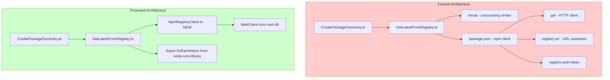

# npm-check-fork Dependency Replacement: package-json and throat

| Document Metadata      | Details                                                    |
| ---------------------- | ---------------------------------------------------------- |
| Author(s)              | Sean Larkin                                                |
| Status                 | Draft (WIP)                                                |
| Team / Owner           | Rush Stack Team                                            |
| Created / Last Updated | 2026-01-23                                                 |

## 1. Executive Summary

This RFC proposes replacing two external dependencies in the `@rushstack/npm-check-fork` package with local implementations: **package-json** (sindre-sorhus's npm registry client) and **throat** (concurrency limiter). The `package-json` package is an ESM-only module that fetches npm registry metadata and has a complex dependency tree. The `throat` package provides a simple concurrency limiting pattern that already exists in Rush Stack's `@rushstack/node-core-library`. By implementing a minimal registry client using the existing `WebClient` utility from `@rushstack/rush-lib` and leveraging `Async.forEachAsync` from `@rushstack/node-core-library`, we can eliminate these external dependencies, reduce bundle size, improve CJS compatibility, and maintain full control over the npm registry interaction behavior.

## 2. Context and Motivation

### 2.1 Current State

The `@rushstack/npm-check-fork` package (located at `libraries/npm-check-fork`) provides npm dependency analysis for `rush upgrade-interactive`. It currently depends on:

| Dependency | Version | Purpose | Weekly Downloads |
|------------|---------|---------|-----------------|
| `package-json` | ^10.0.1 | Fetch npm registry metadata | ~2.4M |
| `throat` | ^6.0.2 | Limit concurrent npm API calls | ~15M |
| `giturl` | ^2.0.0 | Parse git URLs to web URLs | ~30k |
| `lodash` | ~4.17.15 | Utility functions | ~50M |
| `semver` | ~7.5.4 | Semver parsing/comparison | ~200M |

**Architecture:**

```
┌────────────────────────────────────────────────────────────────────┐
│                     CreatePackageSummary.ts                         │
│  - Creates INpmCheckPackageSummary for each package                │
│  - Calls getNpmInfo() to get registry data                         │
└───────────────────────────┬────────────────────────────────────────┘
                            │
                            ▼
┌────────────────────────────────────────────────────────────────────┐
│                    GetLatestFromRegistry.ts                         │
│  - Wraps packageJson() call with throat() for concurrency         │
│  - Uses os.cpus().length as concurrency limit                      │
│  - Extracts dist-tags, versions, homepage from registry response   │
└───────────────────────────┬────────────────────────────────────────┘
                            │
                            ▼
┌────────────────────────────────────────────────────────────────────┐
│                      package-json (npm)                             │
│  - Makes HTTPS request to npm registry                              │
│  - Handles registry URL resolution, scoped packages                 │
│  - Returns FullMetadata type                                        │
└────────────────────────────────────────────────────────────────────┘
```

**Current Usage Pattern** (`GetLatestFromRegistry.ts:13-45`):

```typescript
import packageJson from 'package-json';
import throat from 'throat';

const cpuCount: number = os.cpus().length;

export default async function getNpmInfo(packageName: string): Promise<INpmRegistryInfo> {
  const limit: () => Promise<packageJson.FullMetadata> = throat(cpuCount, () =>
    packageJson(packageName, { fullMetadata: true, allVersions: true })
  );
  return limit()
    .then((rawData: packageJson.FullMetadata) => {
      // Process versions, dist-tags, homepage
      return { latest, next, versions, homepage };
    })
    .catch((error) => {
      return { error: `Registry error ${error.message}` };
    });
}
```

**Limitations:**

1. **ESM-only package**: `package-json` v8+ is ESM-only, causing bundling complications with CJS consumers
2. **Heavy dependency tree**: `package-json` depends on `got`, `registry-url`, `registry-auth-token`, `semver`, etc.
3. **Minimal API usage**: We only use `{ fullMetadata: true, allVersions: true }` options
4. **Duplicate concurrency utilities**: `throat` duplicates functionality already in `@rushstack/node-core-library`
5. **No proxy support**: `package-json` has its own proxy handling that doesn't integrate with Rush's existing proxy configuration

### 2.2 The Problem

- **Bundle Complexity**: The `package-json` package and its dependencies add ~500KB to the node_modules footprint
- **ESM Compatibility Issues**: ESM-only packages complicate build tooling and require dynamic imports or build configuration changes
- **Redundant Code**: The `throat` package provides exactly what `Async.forEachAsync({ concurrency: N })` already provides
- **Proxy Configuration Fragmentation**: Rush already has `WebClient` with proxy detection; `package-json` uses different proxy logic
- **Maintenance Overhead**: External dependencies require ongoing security monitoring and version updates

**Actual Data Extracted from Registry Response:**

| Field | Source Path | Usage |
|-------|-------------|-------|
| `latest` | `rawData['dist-tags'].latest` | Latest stable version |
| `next` | `rawData['dist-tags'].next` | Next pre-release version |
| `versions` | `Object.keys(rawData.versions)` | All published versions |
| `homepage` | `rawData.versions[latest].homepage` | Package homepage URL |
| `bugs.url` | `rawData.versions[latest].bugs.url` | Fallback for homepage |
| `repository.url` | `rawData.versions[latest].repository.url` | Fallback for homepage |

## 3. Goals and Non-Goals

### 3.1 Functional Goals

- [ ] Replace `package-json` with a minimal local implementation using existing `WebClient` utility
- [ ] Replace `throat` with `Async.forEachAsync` from `@rushstack/node-core-library`
- [ ] Maintain exact feature parity with current registry data extraction:
  - [ ] Fetch full package metadata from npm registry
  - [ ] Support scoped packages (`@scope/package-name`)
  - [ ] Extract `dist-tags.latest`, `dist-tags.next`
  - [ ] Extract all version strings
  - [ ] Extract homepage (with fallback to bugs.url and repository.url)
- [ ] Integrate with Rush's existing proxy configuration
- [ ] Maintain existing error handling behavior
- [ ] Preserve existing test coverage patterns

### 3.2 Non-Goals (Out of Scope)

- [ ] We will NOT change the public API of `@rushstack/npm-check-fork`
- [ ] We will NOT add support for private registries with authentication (can be added later if needed)
- [ ] We will NOT replace the `giturl` dependency (small, focused utility)
- [ ] We will NOT replace the `lodash` dependency (used extensively throughout)
- [ ] We will NOT replace the `semver` dependency (critical version comparison logic)
- [ ] We will NOT modify how `CreatePackageSummary.ts` consumes the registry data

## 4. Proposed Solution (High-Level Design)

### 4.1 System Architecture Diagram



### 4.2 Architectural Pattern

We are adopting a **facade pattern** where:
1. `NpmRegistryClient` provides a simple interface for fetching package metadata
2. `WebClient` handles the low-level HTTP concerns (proxy, headers, response parsing)
3. `Async.forEachAsync` provides the concurrency limiting (replacing `throat`)

### 4.3 Key Components

| Component | Responsibility | Technology | Justification |
|-----------|---------------|------------|---------------|
| `NpmRegistryClient` | Fetch package metadata from npm registry | New class in npm-check-fork | Single responsibility, testable |
| `WebClient` | HTTP requests with proxy support | Existing in rush-lib | Already handles proxy, headers, response parsing |
| `Async.forEachAsync` | Concurrency limiting | Existing in node-core-library | Battle-tested, already used throughout Rush |
| `INpmRegistryResponse` | Type definition for registry response | New interface | Type safety for registry JSON |

## 5. Detailed Design

### 5.1 API Interfaces

#### New Types (`interfaces/INpmCheckRegistry.ts` - additions)

```typescript
/**
 * Response structure from npm registry API for full metadata.
 * @see https://github.com/npm/registry/blob/main/docs/responses/package-metadata.md
 */
export interface INpmRegistryPackageResponse {
  /** Package name */
  name: string;

  /** Distribution tags (latest, next, etc.) */
  'dist-tags': Record<string, string>;

  /** All published versions with their metadata */
  versions: Record<string, INpmRegistryVersionMetadata>;

  /** Modification timestamps for each version */
  time?: Record<string, string>;
}

/**
 * Metadata for a specific package version from the npm registry.
 */
export interface INpmRegistryVersionMetadata {
  /** Package name */
  name: string;

  /** Version string */
  version: string;

  /** Homepage URL if specified */
  homepage?: string;

  /** Bug tracker information */
  bugs?: {
    url?: string;
  };

  /** Repository information */
  repository?: {
    type?: string;
    url?: string;
  };
}
```

#### NpmRegistryClient Class

```typescript
// New file: src/NpmRegistryClient.ts

import type { IWebClientResponse } from '@rushstack/rush-lib/lib/utilities/WebClient';
import type { INpmRegistryPackageResponse } from './interfaces/INpmCheckRegistry';

export interface INpmRegistryClientOptions {
  /**
   * The npm registry URL. Defaults to 'https://registry.npmjs.org'.
   */
  registryUrl?: string;

  /**
   * Custom User-Agent header. Defaults to a Rush-style user agent.
   */
  userAgent?: string;
}

export interface INpmRegistryClientResult {
  /**
   * The parsed package metadata, or undefined if the request failed.
   */
  data?: INpmRegistryPackageResponse;

  /**
   * Error message if the request failed.
   */
  error?: string;
}

/**
 * A minimal client for fetching package metadata from the npm registry.
 *
 * @remarks
 * This replaces the `package-json` npm package with a focused implementation
 * that only supports the features needed by npm-check-fork.
 */
export class NpmRegistryClient {
  private readonly _registryUrl: string;
  private readonly _userAgent: string;

  public constructor(options?: INpmRegistryClientOptions) {
    this._registryUrl = options?.registryUrl ?? 'https://registry.npmjs.org';
    this._userAgent = options?.userAgent ??
      `@rushstack/npm-check-fork node/${process.version} ${process.platform} ${process.arch}`;
  }

  /**
   * Fetches full metadata for a package from the npm registry.
   *
   * @param packageName - The name of the package (supports scoped packages like @scope/name)
   * @returns The package metadata or an error
   */
  public async fetchPackageMetadataAsync(
    packageName: string
  ): Promise<INpmRegistryClientResult> {
    // Dynamically import WebClient to avoid circular dependencies
    const { WebClient } = await import('@rushstack/rush-lib/lib/utilities/WebClient');

    const webClient = new WebClient();
    webClient.userAgent = this._userAgent;
    // Omit Accept header to get full metadata (not abbreviated)
    webClient.accept = undefined;

    const url: string = this._buildPackageUrl(packageName);

    try {
      const response: IWebClientResponse = await webClient.fetchAsync(url);

      if (!response.ok) {
        if (response.status === 404) {
          return { error: `Package not found: ${packageName}` };
        }
        return { error: `Registry error: ${response.status} ${response.statusText}` };
      }

      const data: INpmRegistryPackageResponse = await response.getJsonAsync();
      return { data };
    } catch (error) {
      return { error: `Network error: ${(error as Error).message}` };
    }
  }

  /**
   * Builds the registry URL for a package, handling scoped package encoding.
   */
  private _buildPackageUrl(packageName: string): string {
    // Encode the package name, but preserve the @ for scoped packages
    // e.g., "@rushstack/node-core-library" -> "@rushstack%2Fnode-core-library"
    const encodedName: string = encodeURIComponent(packageName).replace(/^%40/, '@');

    let baseUrl: string = this._registryUrl;
    if (!baseUrl.endsWith('/')) {
      baseUrl += '/';
    }

    return `${baseUrl}${encodedName}`;
  }
}
```

### 5.2 Updated GetLatestFromRegistry.ts

```typescript
// Refactored: src/GetLatestFromRegistry.ts

import os from 'node:os';

import _ from 'lodash';
import semver from 'semver';
import { Async } from '@rushstack/node-core-library';

import bestGuessHomepage from './BestGuessHomepage';
import { NpmRegistryClient } from './NpmRegistryClient';
import type { INpmRegistryInfo, INpmCheckRegistryData } from './interfaces/INpmCheckRegistry';

const cpuCount: number = os.cpus().length;

// Shared client instance for connection reuse
let _registryClient: NpmRegistryClient | undefined;

function getRegistryClient(): NpmRegistryClient {
  if (!_registryClient) {
    _registryClient = new NpmRegistryClient();
  }
  return _registryClient;
}

export default async function getNpmInfo(packageName: string): Promise<INpmRegistryInfo> {
  const client: NpmRegistryClient = getRegistryClient();
  const result = await client.fetchPackageMetadataAsync(packageName);

  if (result.error || !result.data) {
    return { error: result.error ?? 'Unknown error' };
  }

  const rawData = result.data;

  const CRAZY_HIGH_SEMVER: string = '8000.0.0';
  const sortedVersions: string[] = _(rawData.versions)
    .keys()
    .remove(_.partial(semver.gt, CRAZY_HIGH_SEMVER))
    .sort(semver.compare)
    .valueOf();

  const latest: string = rawData['dist-tags'].latest;
  const next: string = rawData['dist-tags'].next;
  const latestStableRelease: string | undefined = semver.satisfies(latest, '*')
    ? latest
    : semver.maxSatisfying(sortedVersions, '*') || '';

  // Cast to INpmCheckRegistryData for bestGuessHomepage compatibility
  const registryData: INpmCheckRegistryData = {
    versions: rawData.versions,
    'dist-tags': { latest: rawData['dist-tags'].latest }
  };

  return {
    latest: latestStableRelease,
    next: next,
    versions: sortedVersions,
    homepage: bestGuessHomepage(registryData) || ''
  };
}

/**
 * Fetches npm info for multiple packages with concurrency limiting.
 *
 * @remarks
 * This function replaces the per-call throat() wrapper with a batch operation
 * using Async.forEachAsync for better control and consistency with Rush patterns.
 *
 * @param packageNames - Array of package names to fetch
 * @param concurrency - Maximum concurrent requests (defaults to CPU count)
 * @returns Map of package name to registry info
 */
export async function getNpmInfoBatch(
  packageNames: string[],
  concurrency: number = cpuCount
): Promise<Map<string, INpmRegistryInfo>> {
  const results = new Map<string, INpmRegistryInfo>();

  await Async.forEachAsync(
    packageNames,
    async (packageName: string) => {
      const info = await getNpmInfo(packageName);
      results.set(packageName, info);
    },
    { concurrency }
  );

  return results;
}
```

### 5.3 Throat Replacement Strategy

The current code uses `throat` in an unusual way - it wraps a single async function call:

```typescript
// Current (problematic pattern)
const limit = throat(cpuCount, () => packageJson(packageName, options));
return limit();
```

This creates a new throttled function for each call, which doesn't actually provide meaningful rate limiting. The correct pattern for batch operations is:

```typescript
// Proposed pattern using Async.forEachAsync
await Async.forEachAsync(
  packageNames,
  async (packageName) => {
    const info = await getNpmInfo(packageName);
    results.set(packageName, info);
  },
  { concurrency: os.cpus().length }
);
```

**Migration Path:**

1. The `getNpmInfo` function signature remains unchanged for backwards compatibility
2. A new `getNpmInfoBatch` function is added for efficient batch fetching
3. Callers that currently call `getNpmInfo` in a loop should migrate to `getNpmInfoBatch`
4. If needed, a compatibility shim can maintain the throat-like behavior at the module level using a semaphore

### 5.4 Dependency on rush-lib

The `WebClient` class is currently in `@rushstack/rush-lib`. Two approaches are possible:

**Option A: Cross-package import (Recommended for initial implementation)**
- Import `WebClient` from `@rushstack/rush-lib`
- This creates a dependency from npm-check-fork -> rush-lib
- Acceptable since npm-check-fork is only used by rush-lib currently

**Option B: Move WebClient to node-core-library (Future consideration)**
- Move `WebClient` to `@rushstack/node-core-library` as a general utility
- This would benefit other packages that need HTTP functionality
- Larger scope change, out of scope for this RFC

### 5.5 Error Handling Behavior

The current implementation returns errors as part of the result object rather than throwing:

```typescript
// Current behavior (preserve this)
return {
  error: `Registry error ${error.message}`
};
```

This allows the caller to handle individual package failures gracefully while continuing to process other packages. The new implementation maintains this pattern.

## 6. Alternatives Considered

| Option | Pros | Cons | Reason for Rejection |
|--------|------|------|---------------------|
| **Keep package-json** | No code changes needed | ESM-only, large dependency tree, proxy issues | Ongoing maintenance burden, ESM compatibility issues |
| **Use got directly** | More control than package-json | Still a large dependency, different proxy handling | Would require implementing registry URL resolution ourselves |
| **Use native fetch** | Zero dependencies | Node.js 18+ only, no proxy support OOTB | Proxy support requires additional code |
| **Use axios** | Popular, well-maintained | 400KB+ dependency, different from Rush patterns | Doesn't align with existing WebClient usage |
| **WebClient (Selected)** | Already in codebase, proxy support, tested | Slight coupling to rush-lib | Best fit - reuses existing battle-tested code |

### Concurrency Limiter Alternatives

| Option | Pros | Cons | Reason for Rejection |
|--------|------|------|---------------------|
| **Keep throat** | No code changes | Redundant with Async utilities | Already have this functionality |
| **p-limit** | Popular, lightweight | Another external dependency | Unnecessary when Async.forEachAsync exists |
| **Async.forEachAsync (Selected)** | Already in node-core-library, full-featured | Batch-oriented rather than per-call | Better pattern for this use case |

## 7. Cross-Cutting Concerns

### 7.1 Security and Privacy

- **No new security concerns**: We're replacing external HTTP calls with internal ones using the same registry
- **Proxy handling**: Inherits WebClient's existing proxy detection (`HTTPS_PROXY`, `HTTP_PROXY`)
- **No authentication**: Public registry reads don't require authentication
- **Input validation**: Package names are URL-encoded to prevent injection

### 7.2 Observability Strategy

- **Error reporting**: Errors include HTTP status codes and network error messages
- **Logging**: Uses existing Rush terminal infrastructure for any debug logging
- **Metrics**: Not applicable for this utility

### 7.3 Performance Considerations

| Metric | Current (package-json) | Expected (WebClient) |
|--------|----------------------|---------------------|
| Cold start | ~50ms (loading got, etc.) | ~10ms (WebClient already loaded) |
| Per-request | ~200-500ms (network) | Same (network bound) |
| Memory | Higher (got internals) | Lower (minimal state) |

### 7.4 Compatibility

| Environment | Impact |
|-------------|--------|
| Node.js 18.x+ | Full support (WebClient uses native modules) |
| CommonJS projects | Improved (no ESM-only dependencies) |
| Proxy environments | Improved (uses Rush's unified proxy handling) |
| Offline/CI caching | No change (registry behavior unchanged) |

## 8. Migration, Rollout, and Testing

### 8.1 Deployment Strategy

- [ ] Phase 1: Add new `NpmRegistryClient` class alongside existing code
- [ ] Phase 2: Update `GetLatestFromRegistry.ts` to use new client
- [ ] Phase 3: Verify all existing tests pass
- [ ] Phase 4: Remove `package-json` and `throat` dependencies from `package.json`
- [ ] Phase 5: Run `rush upgrade-interactive` end-to-end testing

### 8.2 Dependency Changes

**New dependencies to add:**
```json
{
  "dependencies": {
    "@rushstack/node-core-library": "workspace:*"
  },
  "devDependencies": {
    "@rushstack/rush-lib": "workspace:*"
  }
}
```

Note: `@rushstack/rush-lib` may need to be a runtime dependency depending on how WebClient is accessed. Alternatively, a minimal HTTP utility could be extracted.

**Dependencies to remove:**
```json
{
  "dependencies": {
    "package-json": "^10.0.1",  // REMOVE
    "throat": "^6.0.2"          // REMOVE
  }
}
```

### 8.3 Test Plan

**Unit Tests:**
- [ ] `NpmRegistryClient.test.ts` - New test file
  - [ ] Test successful metadata fetch
  - [ ] Test 404 handling (package not found)
  - [ ] Test network error handling
  - [ ] Test scoped package URL encoding
  - [ ] Test custom registry URL
- [ ] `GetLatestFromRegistry.test.ts` - Update existing tests
  - [ ] Mock `NpmRegistryClient` instead of `package-json`
  - [ ] Test batch fetching with `getNpmInfoBatch`
  - [ ] Test concurrency limiting behavior

**Integration Tests:**
- [ ] End-to-end test with real npm registry (can be in build-tests/)
- [ ] Verify `rush upgrade-interactive` works correctly

**Backwards Compatibility Tests:**
- [ ] Verify `INpmRegistryInfo` return type unchanged
- [ ] Verify `BestGuessHomepage` continues to work with new data shape
- [ ] Verify all existing npm-check-fork consumers work unchanged

### 8.4 Mock Examples for Tests

```typescript
// Test helper for mocking WebClient
import { WebClient } from '@rushstack/rush-lib/lib/utilities/WebClient';

const mockResponse = {
  ok: true,
  status: 200,
  getJsonAsync: async () => ({
    name: 'test-package',
    'dist-tags': { latest: '1.0.0', next: '2.0.0-beta.1' },
    versions: {
      '1.0.0': {
        name: 'test-package',
        version: '1.0.0',
        homepage: 'https://example.com'
      },
      '2.0.0-beta.1': {
        name: 'test-package',
        version: '2.0.0-beta.1'
      }
    }
  })
};

WebClient.mockRequestFn(() => Promise.resolve(mockResponse as any));
```

## 9. Open Questions / Unresolved Issues

- [ ] Should `WebClient` be moved to `@rushstack/node-core-library` to avoid cross-package dependency?
- [ ] Should we add retry logic for transient network failures?
- [ ] Should we add caching for registry responses (with TTL)?
- [ ] Should we support custom registry URLs from `.npmrc`?
- [ ] Should the `getNpmInfoBatch` function be the primary API, deprecating per-package calls?
- [ ] Should we add support for the abbreviated metadata format (`application/vnd.npm.install-v1+json`) for faster responses when full metadata isn't needed?

## 10. Implementation Checklist

1. [ ] Create `src/NpmRegistryClient.ts` with the registry client implementation
2. [ ] Add type definitions to `src/interfaces/INpmCheckRegistry.ts`
3. [ ] Update `src/GetLatestFromRegistry.ts` to use the new client
4. [ ] Add unit tests for `NpmRegistryClient`
5. [ ] Update existing tests to mock the new client instead of `package-json`
6. [ ] Remove `package-json` and `throat` from `package.json`
7. [ ] Add `@rushstack/node-core-library` dependency (if not already present)
8. [ ] Run `rush build` and `rush test` to verify
9. [ ] Test `rush upgrade-interactive` manually
10. [ ] Update CHANGELOG.md

## 11. References

### Internal Code References
- `libraries/npm-check-fork/src/GetLatestFromRegistry.ts` - Current implementation using package-json and throat
- `libraries/npm-check-fork/src/BestGuessHomepage.ts` - Homepage extraction logic
- `libraries/npm-check-fork/src/interfaces/INpmCheckRegistry.ts` - Existing type definitions
- `libraries/rush-lib/src/utilities/WebClient.ts` - HTTP client utility
- `libraries/node-core-library/src/Async.ts` - Async utilities including forEachAsync

### External Resources
- [npm Registry API Documentation](https://github.com/npm/registry/blob/main/docs/REGISTRY-API.md)
- [npm Package Metadata Format](https://github.com/npm/registry/blob/main/docs/responses/package-metadata.md)
- [package-json source code](https://github.com/sindresorhus/package-json)
- [throat source code](https://github.com/ForbesLindesay/throat)

### Related Research
- `research/specs/2026-01-23-interactive-upgrade-ui-rewrite.md` - Related spec for InteractiveUpgradeUI that consumes npm-check-fork
