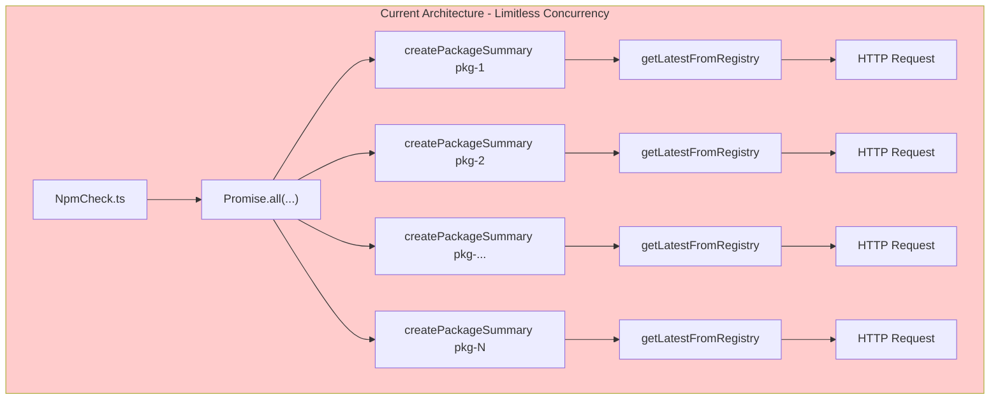

# Refactor createPackageSummary to Use getNpmBatchInfo

| Document Metadata      | Details                    |
| ---------------------- | -------------------------- |
| Author(s)              | Sean Larkin                |
| Status                 | Draft (WIP)                |
| Team / Owner           | Rush Stack Team            |
| Created / Last Updated | 2026-01-24                 |

## 1. Executive Summary

This RFC proposes refactoring the `createPackageSummary` function in `@rushstack/npm-check-fork` to use the newly implemented `getNpmInfoBatch` function instead of making individual registry requests per package. Currently, `NpmCheck.ts` calls `createPackageSummary` for each dependency using `Promise.all`, which results in limitless concurrent requests to the npm registry. The proposed solution batches all package names upfront, fetches registry data with controlled concurrency via `getNpmInfoBatch`, then processes each package summary with pre-fetched data. This reduces network overhead, respects npm registry rate limits, and improves overall performance for projects with many dependencies.

**Reference:** This spec builds upon the prior work documented in [`research/specs/2026-01-23-npm-check-fork-dependency-replacement.md`](./2026-01-23-npm-check-fork-dependency-replacement.md) which introduced `NpmRegistryClient` and `getNpmInfoBatch`.

## 2. Context and Motivation

### 2.1 Current State

The `@rushstack/npm-check-fork` package provides dependency analysis for `rush upgrade-interactive`. The current control flow is:

```
NpmCheck.ts
  └── For each dependency in package.json:
        └── createPackageSummary(moduleName, state)
              └── getLatestFromRegistry(moduleName)  <-- Individual HTTP request
                    └── NpmRegistryClient.fetchPackageMetadataAsync()
```

**Architecture Diagram:**

```
┌─────────────────────────────────────────────────────────────────────────────┐
│                            NpmCheck.ts (L15-22)                             │
│                                                                             │
│   const packageSummaryPromises = Object.keys(allDependencies)               │
│     .map((moduleName) => createPackageSummary(moduleName, state));          │
│                                                                             │
│   packages = await Promise.all(packageSummaryPromises);                     │
│                                                                             │
│   ┌─────────────────────────────────────────────────────────────────┐      │
│   │  Promise.all launches ALL requests simultaneously               │      │
│   │  No concurrency control - 100 deps = 100 parallel HTTP requests │      │
│   └─────────────────────────────────────────────────────────────────┘      │
└─────────────────────────────────────────────────────────────────────────────┘
                                    │
                                    ▼
┌─────────────────────────────────────────────────────────────────────────────┐
│                       CreatePackageSummary.ts (L37)                         │
│                                                                             │
│   return getLatestFromRegistry(moduleName).then((fromRegistry) => {        │
│     // ... process registry data into INpmCheckPackageSummary              │
│   });                                                                       │
└─────────────────────────────────────────────────────────────────────────────┘
                                    │
                                    ▼
┌─────────────────────────────────────────────────────────────────────────────┐
│                       GetLatestFromRegistry.ts (L38-72)                     │
│                                                                             │
│   export default async function getNpmInfo(packageName): Promise<...> {     │
│     const client = getRegistryClient();                                     │
│     const result = await client.fetchPackageMetadataAsync(packageName);     │
│     // ... transform to INpmRegistryInfo                                    │
│   }                                                                         │
│                                                                             │
│   // NOTE: getNpmInfoBatch exists (L81-97) but is NOT used by callers!     │
│   // TODO comment on L87: "Refactor createPackageSummary to use this"       │
└─────────────────────────────────────────────────────────────────────────────┘
```

**Current Usage Pattern** (from `NpmCheck.ts:15-22`):

```typescript
const packageSummaryPromises: Promise<INpmCheckPackageSummary | false>[] = Object.keys(
  allDependencies
).map((moduleName: string) => createPackageSummary(moduleName, state));

packages = await Promise.all(packageSummaryPromises).then(
  (results: (INpmCheckPackageSummary | false)[]) => {
    return results.filter((pkg): pkg is INpmCheckPackageSummary => pkg !== false);
  }
);
```

**Limitations:**

1. **Limitless concurrency**: `Promise.all` launches all HTTP requests simultaneously
2. **No rate limiting**: A project with 200 dependencies creates 200 parallel connections to registry.npmjs.org
3. **Registry throttling risk**: npm registry may throttle or reject excessive concurrent requests
4. **Unused batch function**: `getNpmInfoBatch` was implemented (see `research/progress.txt` Feature 4) but never integrated
5. **Network inefficiency**: Each request has TCP/TLS overhead; batched requests could potentially reuse connections

### 2.2 The Problem

- **Rate Limit Risk**: Projects with 100+ dependencies may trigger npm registry rate limiting (429 Too Many Requests)
- **Resource Exhaustion**: Large dependency counts can exhaust file descriptors or connection pools
- **Unrealized Optimization**: The `getNpmInfoBatch` function with `Async.forEachAsync` concurrency control exists but is unused
- **TODO Comment Left Behind**: `GetLatestFromRegistry.ts:87` contains `// TODO: Refactor createPackageSummary to use this batch function`

**Evidence from Implementation:**

Per `research/progress.txt`:
> **Feature 4: getNpmInfoBatch Function (COMPLETE)**
> - Function signature: `getNpmInfoBatch(packageNames: string[], concurrency?: number): Promise<Map<string, INpmRegistryInfo>>`
> - Default concurrency: `os.cpus().length` (matching original throat behavior)

The batch function exists and is exported, but `createPackageSummary` still calls `getLatestFromRegistry` individually.

## 3. Goals and Non-Goals

### 3.1 Functional Goals

- [ ] Refactor `NpmCheck.ts` to collect all package names before making registry requests
- [ ] Use `getNpmInfoBatch` to fetch all registry data with controlled concurrency (default: `os.cpus().length`)
- [ ] Modify `createPackageSummary` to accept pre-fetched registry data instead of fetching it internally
- [ ] Maintain exact behavioral parity with the current implementation (same return values, error handling)
- [ ] Remove the TODO comment from `GetLatestFromRegistry.ts:87` after completion
- [ ] Preserve backwards compatibility for any external consumers of `createPackageSummary` (if any)

### 3.2 Non-Goals (Out of Scope)

- [ ] We will NOT change the public API of `@rushstack/npm-check-fork` (exports from `index.ts`)
- [ ] We will NOT modify the `NpmRegistryClient` class or its behavior
- [ ] We will NOT add HTTP/2 multiplexing or connection pooling optimizations
- [ ] We will NOT add caching for registry responses
- [ ] We will NOT change the default concurrency value (remains `os.cpus().length`)
- [ ] We will NOT modify how `rush upgrade-interactive` invokes `NpmCheck`

## 4. Proposed Solution (High-Level Design)

### 4.1 System Architecture Diagram

**Before (Current):**



**After (Proposed):**

```mermaid
flowchart TB
    subgraph Proposed["Proposed Architecture - Controlled Concurrency"]
        NC2[NpmCheck.ts] --> Collect[Collect all package names]
        Collect --> Filter[Filter out private/invalid packages]
        Filter --> Batch["getNpmInfoBatch(packageNames, concurrency)"]
        Batch --> Async["Async.forEachAsync\n(concurrency: os.cpus().length)"]

        Async --> H1[HTTP Request]
        Async --> H2[HTTP Request]
        Async --> H3[HTTP Request]
        Async --> H4[HTTP Request]

        Batch --> Results["Map<string, INpmRegistryInfo>"]
        Results --> Process["createPackageSummary\n(with pre-fetched data)"]
        Process --> Summary[INpmCheckPackageSummary[]]
    end

    style Proposed fill:#ccffcc
```

### 4.2 Architectural Pattern

We are adopting a **Two-Phase Processing Pattern**:

1. **Phase 1 - Data Collection**: Gather all package names, perform local validation (private packages, invalid semver), then batch-fetch all registry data with controlled concurrency
2. **Phase 2 - Data Processing**: Process each package with pre-fetched registry data (pure CPU-bound, no I/O)

This separates I/O-bound work (network requests) from CPU-bound work (version comparison, summary generation), allowing optimal handling of each.

### 4.3 Key Components

| Component | Current Responsibility | Proposed Change |
|-----------|----------------------|-----------------|
| `NpmCheck.ts` | Iterate packages, call `createPackageSummary` | Add batch registry fetch before iteration |
| `CreatePackageSummary.ts` | Fetch registry data, build summary | Accept registry data as parameter, build summary only |
| `GetLatestFromRegistry.ts` | Export `getNpmInfo` (single) and `getNpmInfoBatch` | No change (already has batch function) |
| `getNpmInfoBatch` | Batch fetch with concurrency | Used by `NpmCheck.ts` (currently unused) |

## 5. Detailed Design

### 5.1 API Changes

#### Modified Function Signature: `createPackageSummary`

**Current Signature:**
```typescript
// CreatePackageSummary.ts
export default async function createPackageSummary(
  moduleName: string,
  state: INpmCheckState
): Promise<INpmCheckPackageSummary | false>
```

**Proposed Signature (Option A - Recommended):**
```typescript
// CreatePackageSummary.ts
export default async function createPackageSummary(
  moduleName: string,
  state: INpmCheckState,
  registryInfo?: INpmRegistryInfo  // Optional for backwards compat
): Promise<INpmCheckPackageSummary | false>
```

If `registryInfo` is provided, skip the `getLatestFromRegistry` call. If not provided, fall back to current behavior (fetch individually). This maintains backwards compatibility while enabling optimization.

**Alternative (Option B - Breaking Change):**
```typescript
// CreatePackageSummary.ts
export default function createPackageSummary(
  moduleName: string,
  state: INpmCheckState,
  registryInfo: INpmRegistryInfo  // Required, no longer async for I/O
): INpmCheckPackageSummary | false
```

This makes the function synchronous since no I/O occurs. However, this is a breaking change if `createPackageSummary` is exported or used externally.

**Recommendation:** Use Option A for backwards compatibility. The function is not currently exported from `index.ts`, so Option B could also be considered if we verify no external usage.

### 5.2 Updated NpmCheck.ts Implementation

```typescript
// Refactored: src/NpmCheck.ts

import _ from 'lodash';
import { existsSync } from 'node:fs';
import path from 'node:path';
import semver from 'semver';

import type { INpmCheckPackageJson, INpmCheckState } from './interfaces/INpmCheck.ts';
import type { INpmCheckPackageSummary } from './interfaces/INpmCheckPackageSummary';
import type { INpmRegistryInfo } from './interfaces/INpmCheckRegistry';
import createPackageSummary from './CreatePackageSummary';
import { getNpmInfoBatch } from './GetLatestFromRegistry';
import findModulePath from './FindModulePath';
import readPackageJson from './ReadPackageJson';
import initializeState from './NpmCheckState';

export default async function NpmCheck(initialOptions?: INpmCheckState): Promise<INpmCheckState> {
  const state: INpmCheckState = await initializeState(initialOptions);
  const cwdPackageJson: INpmCheckPackageJson | undefined = state.cwdPackageJson;
  const allDependencies: Record<string, string> | undefined = getDependencies(cwdPackageJson);

  let packages: INpmCheckPackageSummary[] = [];

  if (allDependencies) {
    const dependencyNames: string[] = Object.keys(allDependencies);

    // Phase 1: Filter out packages that don't need registry lookup
    const packagesToFetch: string[] = filterPackagesForRegistryLookup(
      dependencyNames,
      cwdPackageJson,
      state
    );

    // Phase 2: Batch fetch all registry data with controlled concurrency
    const registryDataMap: Map<string, INpmRegistryInfo> = await getNpmInfoBatch(packagesToFetch);

    // Phase 3: Create package summaries with pre-fetched data
    const packageSummaryPromises: Promise<INpmCheckPackageSummary | false>[] = dependencyNames.map(
      (moduleName: string) => {
        const registryInfo: INpmRegistryInfo | undefined = registryDataMap.get(moduleName);
        return createPackageSummary(moduleName, state, registryInfo);
      }
    );

    packages = await Promise.all(packageSummaryPromises).then(
      (results: (INpmCheckPackageSummary | false)[]) => {
        return results.filter((pkg): pkg is INpmCheckPackageSummary => pkg !== false);
      }
    );
  }

  return { ...state, packages };
}

/**
 * Filters packages to determine which ones need registry lookup.
 * Excludes private packages and packages with non-semver versions (git URLs, file paths).
 */
function filterPackagesForRegistryLookup(
  dependencyNames: string[],
  cwdPackageJson: INpmCheckPackageJson | undefined,
  state: INpmCheckState
): string[] {
  return dependencyNames.filter((moduleName: string) => {
    // Check if package uses a non-semver version (git URL, file path, etc.)
    const packageJsonVersion: string | undefined =
      cwdPackageJson?.dependencies[moduleName] || cwdPackageJson?.devDependencies[moduleName];
    if (packageJsonVersion && !semver.validRange(packageJsonVersion)) {
      return false;
    }

    // Check if package is private (requires reading its package.json)
    const modulePath: string = findModulePath(moduleName, state);
    if (existsSync(modulePath)) {
      const modulePackageJson = readPackageJson(path.join(modulePath, 'package.json'));
      if (modulePackageJson.private) {
        return false;
      }
    }

    return true;
  });
}

function getDependencies(pkg: INpmCheckPackageJson | undefined): Record<string, string> | undefined {
  if (!pkg) {
    return undefined;
  }

  return _.extend(pkg.dependencies, pkg.devDependencies);
}
```

### 5.3 Updated CreatePackageSummary.ts Implementation

```typescript
// Refactored: src/CreatePackageSummary.ts

import { existsSync } from 'node:fs';
import path from 'node:path';

import _ from 'lodash';
import semver from 'semver';

import type { INpmCheckState, INpmCheckPackageJson } from './interfaces/INpmCheck.ts';
import type { INpmCheckPackageSummary, INpmCheckVersionBumpType } from './interfaces/INpmCheckPackageSummary';
import type { INpmRegistryInfo } from './interfaces/INpmCheckRegistry';
import findModulePath from './FindModulePath';
import getLatestFromRegistry from './GetLatestFromRegistry';
import readPackageJson from './ReadPackageJson';

/**
 * Creates a package summary for a single dependency.
 *
 * @param moduleName - The name of the module to summarize
 * @param state - The npm-check state containing cwd and package.json data
 * @param registryInfo - Optional pre-fetched registry info. If not provided,
 *                       the function will fetch from the registry (legacy behavior).
 * @returns The package summary, or false if the package should be excluded
 */
export default async function createPackageSummary(
  moduleName: string,
  state: INpmCheckState,
  registryInfo?: INpmRegistryInfo
): Promise<INpmCheckPackageSummary | false> {
  const cwdPackageJson: INpmCheckPackageJson | undefined = state.cwdPackageJson;

  const modulePath: string = findModulePath(moduleName, state);
  const packageIsInstalled: boolean = existsSync(modulePath);
  const modulePackageJson: INpmCheckPackageJson = readPackageJson(path.join(modulePath, 'package.json'));

  // Ignore private packages
  const isPrivate: boolean = Boolean(modulePackageJson.private);
  if (isPrivate) {
    return false;
  }

  // Ignore packages that are using github or file urls
  const packageJsonVersion: string | undefined =
    cwdPackageJson?.dependencies[moduleName] || cwdPackageJson?.devDependencies[moduleName];
  if (packageJsonVersion && !semver.validRange(packageJsonVersion)) {
    return false;
  }

  // Use pre-fetched registry info if available, otherwise fetch (legacy behavior)
  const fromRegistry: INpmRegistryInfo = registryInfo ?? await getLatestFromRegistry(moduleName);

  return buildPackageSummary(
    moduleName,
    cwdPackageJson,
    modulePackageJson,
    packageIsInstalled,
    packageJsonVersion,
    fromRegistry
  );
}

/**
 * Builds the package summary from the gathered data.
 * This is a pure function with no I/O operations.
 */
function buildPackageSummary(
  moduleName: string,
  cwdPackageJson: INpmCheckPackageJson | undefined,
  modulePackageJson: INpmCheckPackageJson,
  packageIsInstalled: boolean,
  packageJsonVersion: string | undefined,
  fromRegistry: INpmRegistryInfo
): INpmCheckPackageSummary {
  const installedVersion: string | undefined = modulePackageJson.version;
  const latest: string | undefined =
    installedVersion &&
    fromRegistry.latest &&
    fromRegistry.next &&
    semver.gt(installedVersion, fromRegistry.latest)
      ? fromRegistry.next
      : fromRegistry.latest;
  const versions: string[] = fromRegistry.versions || [];
  let versionWanted: string | null = null;
  if (packageJsonVersion) {
    versionWanted = semver.maxSatisfying(versions, packageJsonVersion);
  }
  const versionToUse: string | undefined | null = installedVersion || versionWanted;
  const usingNonSemver: boolean | '' | null =
    latest !== undefined && semver.valid(latest) && semver.lt(latest, '1.0.0-pre');

  let bump: INpmCheckVersionBumpType;
  const bumpRaw: INpmCheckVersionBumpType =
    semver.valid(latest) &&
    semver.valid(versionToUse) &&
    (usingNonSemver && versionToUse && latest
      ? semver.diff(versionToUse, latest)
        ? 'nonSemver'
        : semver.diff(versionToUse, latest)
      : versionToUse && latest
        ? semver.diff(versionToUse, latest)
        : undefined);
  if (bumpRaw && bumpRaw !== null) {
    bump = bumpRaw as INpmCheckVersionBumpType;
  } else {
    bump = undefined;
  }

  return {
    // info
    moduleName: moduleName,
    homepage: fromRegistry.homepage ?? '',
    regError: new Error(fromRegistry.error),
    pkgError: modulePackageJson.error,

    // versions
    latest: latest ?? '',
    installed: versionToUse === null ? '' : versionToUse,
    notInstalled: !packageIsInstalled,
    packageJson: packageJsonVersion ?? '',

    // meta
    devDependency: _.has(cwdPackageJson?.devDependencies, moduleName),
    mismatch:
      packageJsonVersion !== undefined &&
      versionToUse !== null &&
      semver.validRange(packageJsonVersion) &&
      semver.valid(versionToUse)
        ? !semver.satisfies(versionToUse, packageJsonVersion)
        : false,
    bump: bump
  };
}
```

### 5.4 Remove TODO Comment

After implementation, remove this line from `GetLatestFromRegistry.ts:87`:

```diff
- // TODO: Refactor createPackageSummary to use this batch function to reduce registry requests
```

### 5.5 Concurrency Configuration

The `getNpmInfoBatch` function accepts an optional `concurrency` parameter:

```typescript
export async function getNpmInfoBatch(
  packageNames: string[],
  concurrency: number = os.cpus().length  // Default: CPU count
): Promise<Map<string, INpmRegistryInfo>>
```

**Current default**: `os.cpus().length` (typically 4-16 on modern systems)

**Rationale for default**:
- Matches the original `throat` concurrency from the replaced implementation
- Provides reasonable rate limiting without being overly conservative
- Can be adjusted in future if npm registry feedback suggests different optimal value

**No changes proposed** to the default concurrency value.

## 6. Alternatives Considered

| Option | Pros | Cons | Reason for Rejection |
|--------|------|------|---------------------|
| **Option 1: No refactor (status quo)** | No code changes, no risk | Limitless concurrency, registry rate limit risk | Does not address the problem identified in TODO |
| **Option 2: Add rate limiting in NpmRegistryClient** | Centralized control | Would need HTTP request queuing, complex | Over-engineering for this use case |
| **Option 3: Refactor NpmCheck.ts only (Selected)** | Minimal changes, uses existing batch function | Requires coordination between files | Best balance of simplicity and effectiveness |
| **Option 4: Make createPackageSummary synchronous** | Cleaner API, no async for CPU work | Breaking change, more refactoring | Riskier, harder to maintain backwards compat |

**Selected Approach:** Option 3 - Refactor `NpmCheck.ts` to use batch fetching while keeping `createPackageSummary` backwards compatible with optional pre-fetched data parameter.

## 7. Cross-Cutting Concerns

### 7.1 Performance Considerations

| Scenario | Current Behavior | Expected Behavior |
|----------|-----------------|-------------------|
| 10 dependencies | 10 parallel requests | Up to 8 parallel (CPU-limited) |
| 100 dependencies | 100 parallel requests | Up to 8 parallel, batched |
| 500 dependencies | 500 parallel requests | Up to 8 parallel, batched |

**Expected improvements:**
- Reduced risk of 429 (Too Many Requests) errors
- More predictable network load
- Potential for TCP connection reuse within batches

### 7.2 Error Handling

**Current behavior** (preserved):
- Registry errors are captured in `INpmRegistryInfo.error` string field
- Errors don't throw; they're returned as part of the result
- Each package's error is independent

**No changes to error handling behavior.**

### 7.3 Backwards Compatibility

| Consumer | Impact |
|----------|--------|
| `rush upgrade-interactive` | None - uses `NpmCheck()` public API |
| Direct `createPackageSummary` calls | None - new parameter is optional |
| External packages importing from index.ts | None - public exports unchanged |

### 7.4 Testing Impact

Tests that mock `getLatestFromRegistry` will continue to work because:
1. `createPackageSummary` still calls `getLatestFromRegistry` when `registryInfo` is not provided
2. Tests can be updated to pass mock registry data directly via the new parameter

## 8. Migration, Rollout, and Testing

### 8.1 Deployment Strategy

- [ ] Phase 1: Update `CreatePackageSummary.ts` with optional `registryInfo` parameter
- [ ] Phase 2: Update `NpmCheck.ts` to use batch fetching pattern
- [ ] Phase 3: Remove TODO comment from `GetLatestFromRegistry.ts`
- [ ] Phase 4: Update unit tests to verify batch behavior
- [ ] Phase 5: Run full integration test with `rush upgrade-interactive`

### 8.2 Test Plan

**Unit Tests:**

- [ ] `NpmCheck.test.ts` - New/updated tests
  - [ ] Verify `getNpmInfoBatch` is called with all dependency names
  - [ ] Verify batch results are passed to `createPackageSummary`
  - [ ] Verify packages excluded from batch (private, git URLs) still handled correctly
  - [ ] Verify concurrency parameter is passed through

- [ ] `CreatePackageSummary.test.ts` - Update existing tests
  - [ ] Test with pre-fetched `registryInfo` parameter (new code path)
  - [ ] Test without `registryInfo` parameter (legacy code path, backwards compat)
  - [ ] Verify identical output regardless of which path is used

**Integration Tests:**

- [ ] Manual test: Run `rush upgrade-interactive` on a project with 50+ dependencies
- [ ] Verify no 429 errors from npm registry
- [ ] Verify all packages display correct version information
- [ ] Compare output with pre-refactor version for identical results

### 8.3 Mock Examples for Tests

```typescript
// NpmCheck.test.ts - Mock batch function
jest.mock('./GetLatestFromRegistry', () => ({
  getNpmInfoBatch: jest.fn().mockResolvedValue(new Map([
    ['lodash', { latest: '4.17.21', versions: ['4.17.20', '4.17.21'], homepage: 'https://lodash.com' }],
    ['semver', { latest: '7.5.4', versions: ['7.5.3', '7.5.4'], homepage: 'https://github.com/npm/node-semver' }]
  ]))
}));

// Verify batch was called
expect(getNpmInfoBatch).toHaveBeenCalledWith(['lodash', 'semver']);
```

```typescript
// CreatePackageSummary.test.ts - Test with pre-fetched data
const mockRegistryInfo: INpmRegistryInfo = {
  latest: '2.0.0',
  next: '3.0.0-beta.1',
  versions: ['1.0.0', '2.0.0', '3.0.0-beta.1'],
  homepage: 'https://example.com'
};

const result = await createPackageSummary('test-pkg', state, mockRegistryInfo);
expect(result).toHaveProperty('latest', '2.0.0');
// Verify getLatestFromRegistry was NOT called
expect(getLatestFromRegistry).not.toHaveBeenCalled();
```

## 9. Open Questions / Unresolved Issues

- [ ] **Q1**: Should we add metrics/logging for batch size and timing?
  - *Current recommendation*: No, keep it simple for now

- [ ] **Q2**: Should the default concurrency be configurable via `INpmCheckState`?
  - *Current recommendation*: No, `os.cpus().length` is a reasonable default
  - Could be added later if users report issues

- [ ] **Q3**: Should we add retry logic for individual failures within the batch?
  - *Current recommendation*: No, current error-as-value pattern is sufficient
  - Failures are already handled gracefully per-package

## 10. Implementation Checklist

1. [ ] Update `CreatePackageSummary.ts`:
   - Add optional `registryInfo?: INpmRegistryInfo` parameter
   - Use provided data when available, fetch otherwise
   - Extract `buildPackageSummary` helper function

2. [ ] Update `NpmCheck.ts`:
   - Add `filterPackagesForRegistryLookup` helper function
   - Call `getNpmInfoBatch` with filtered package names
   - Pass registry data to `createPackageSummary` calls

3. [ ] Remove TODO comment from `GetLatestFromRegistry.ts:87`

4. [ ] Update `CreatePackageSummary.test.ts`:
   - Add test for pre-fetched registry info path
   - Verify backwards compatibility with no-parameter path

5. [ ] Create/update `NpmCheck.test.ts`:
   - Mock `getNpmInfoBatch` instead of individual registry calls
   - Verify batch function receives correct package names
   - Verify filtering logic for private/invalid packages

6. [ ] Run verification:
   - `rush build --to @rushstack/npm-check-fork`
   - `rush test --only @rushstack/npm-check-fork`

7. [ ] Manual integration test:
   - Run `rush upgrade-interactive` in a large test project
   - Verify correct behavior and no registry errors

8. [ ] Update CHANGELOG.md with refactoring note

## 11. References

### Internal Code References

- `libraries/npm-check-fork/src/NpmCheck.ts` - Main entry point, current `Promise.all` pattern
- `libraries/npm-check-fork/src/CreatePackageSummary.ts` - Per-package processing with registry fetch
- `libraries/npm-check-fork/src/GetLatestFromRegistry.ts:81-97` - Existing `getNpmInfoBatch` function
- `libraries/npm-check-fork/src/GetLatestFromRegistry.ts:87` - TODO comment to be resolved
- `libraries/npm-check-fork/src/tests/CreatePackageSummary.test.ts` - Existing tests to update

### Related Research Documents

- [`research/specs/2026-01-23-npm-check-fork-dependency-replacement.md`](./2026-01-23-npm-check-fork-dependency-replacement.md) - Prior RFC implementing `NpmRegistryClient` and `getNpmInfoBatch`
- [`research/progress.txt`](../progress.txt) - Implementation progress log showing Feature 4 (getNpmInfoBatch) complete
- [`research/feature-list.json`](../feature-list.json) - Feature checklist from prior implementation

### External Resources

- [npm Registry API - Rate Limiting](https://docs.npmjs.com/policies/rate-limits)
- [@rushstack/node-core-library Async.forEachAsync](https://api.rushstack.io/pages/node-core-library.async.foreachasync/)
