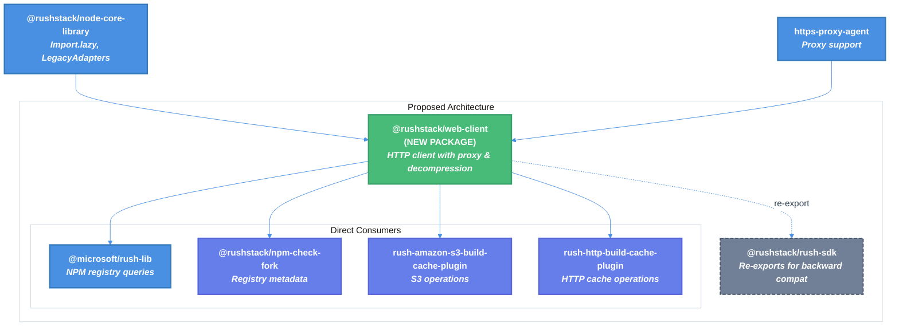

# WebClient Package Extraction Technical Design Document

| Document Metadata      | Details                                    |
| ---------------------- | ------------------------------------------ |
| Author(s)              | Sean Larkin                                |
| Status                 | Draft (WIP)                                |
| Team / Owner           | Rush Stack                                 |
| Created / Last Updated | 2026-01-24                                 |

## 1. Executive Summary

This RFC proposes extracting the `WebClient` class from `@microsoft/rush-lib` into a new standalone package `@rushstack/web-client`. WebClient is an internal HTTP client utility that provides proxy detection, automatic decompression (gzip, deflate, brotli), and redirect handling. Currently, three Rush plugins depend on WebClient via deep imports through `@rushstack/rush-sdk`, and `npm-check-fork` has explicitly requested this extraction to avoid duplicating HTTP logic. The extraction will reduce coupling between packages, enable better code reuse, and allow independent versioning of HTTP client functionality.

**Research Reference:** [2026-01-24-webclient-extraction-analysis.md](../docs/2026-01-24-webclient-extraction-analysis.md)

## 2. Context and Motivation

### 2.1 Current State

WebClient is currently implemented in `libraries/rush-lib/src/utilities/WebClient.ts` (307 lines) and provides a simplified interface for making HTTP/HTTPS requests. The architecture is:

```
rush-lib (internal)
└── utilities/WebClient.ts (definition)
    ├── logic/base/BaseInstallManager.ts (dynamic import)
    └── logic/setup/SetupPackageRegistry.ts (dynamic import)

rush-sdk
└── lib/utilities/WebClient.js (re-export via _rushSdk_loadInternalModule)

Rush Plugins (via rush-sdk deep imports)
├── rush-amazon-s3-build-cache-plugin
├── rush-http-build-cache-plugin
└── rush-amazon-s3-build-cache-plugin-integration-test
```

**Limitations:**
- **Tight Coupling:** Rush plugins must import from internal paths (`@rushstack/rush-sdk/lib/utilities/WebClient`) which is not part of the official public API
- **Code Duplication:** `npm-check-fork` reimplements the same HTTP request logic (proxy handling, decompression, timeouts) because it cannot depend on rush-lib
- **Versioning Constraints:** HTTP client changes require a rush-lib version bump even when unrelated to Rush orchestration
- **Bundle Size:** Rush plugins pull in rush-sdk/rush-lib dependency chains for simple HTTP operations

### 2.2 The Problem

- **Developer Impact:** The `npm-check-fork` library explicitly contains a TODO comment (lines 132-133) requesting WebClient extraction:
  ```typescript
  // TODO: Extract WebClient from rush-lib so that we can use it here
  // instead of this reimplementation of HTTP request logic.
  ```
  This duplication increases maintenance burden and risk of behavioral inconsistencies.

- **Plugin Maintainability:** Rush plugins depend on internal implementation paths that could break without notice. The deep import pattern `@rushstack/rush-sdk/lib/utilities/WebClient` is fragile.

- **Technical Debt:** Having HTTP client functionality buried in a monorepo orchestrator library violates separation of concerns.

## 3. Goals and Non-Goals

### 3.1 Functional Goals

- [x] Create new package `@rushstack/web-client` containing the WebClient class
- [x] Maintain 100% API compatibility with existing WebClient usage
- [x] Preserve test mocking capabilities (`mockRequestFn`, `resetMockRequestFn`)
- [x] Enable `npm-check-fork` to consume WebClient directly
- [x] Maintain backward compatibility via rush-sdk re-exports during transition
- [x] Support all existing compression formats (gzip, deflate, brotli)
- [x] Preserve proxy detection behavior (HTTPS_PROXY, HTTP_PROXY environment variables)

### 3.2 Non-Goals (Out of Scope)

- [ ] Adding streaming response support (can be future enhancement)
- [ ] Adding retry logic to WebClient itself (retry is handled by consumers)
- [ ] Changing the existing API surface beyond extraction
- [ ] Deprecating the rush-sdk re-export path immediately (gradual transition)
- [ ] Adding new authentication mechanisms
- [ ] Supporting HTTP/2 or HTTP/3 protocols

## 4. Proposed Solution (High-Level Design)

### 4.1 System Architecture Diagram



### 4.2 Architectural Pattern

The extraction follows the **Library Extraction Pattern** commonly used in the Rush Stack monorepo:
- Create a new focused package with minimal dependencies
- Re-export from original location for backward compatibility
- Gradually migrate consumers to direct imports
- Deprecate and eventually remove re-export path

### 4.3 Key Components

| Component | Responsibility | Technology Stack | Justification |
|-----------|---------------|------------------|---------------|
| `@rushstack/web-client` | HTTP client with proxy/decompression | TypeScript, Node.js http/https | Focused, reusable package |
| WebClient class | Request execution with configuration | Node.js streams | Existing proven implementation |
| IWebClientResponse | Response interface with lazy body parsing | TypeScript interfaces | Maintains existing API |
| Proxy detection | Environment-based proxy configuration | https-proxy-agent | Enterprise environment support |
| Decompression | Automatic response body decoding | Node.js zlib | NPM registry compatibility |

## 5. Detailed Design

### 5.1 Package Structure

```
libraries/web-client/
├── package.json
├── config/
│   └── rig.json                    # Reference decoupled-local-node-rig
├── src/
│   ├── index.ts                    # Public exports
│   ├── WebClient.ts                # Main implementation (moved from rush-lib)
│   └── test/
│       ├── WebClient.test.ts       # Unit tests
│       └── __snapshots__/
│           └── WebClient.test.ts.snap
├── tsconfig.json
└── .npmignore
```

### 5.2 API Interfaces

The public API surface remains unchanged from the current implementation:

**Exported Types and Interfaces:**

```typescript
/**
 * Response interface with lazy body parsing.
 * @public
 */
export interface IWebClientResponse {
  ok: boolean;
  status: number;
  statusText?: string;
  redirected: boolean;
  headers: Record<string, string | string[] | undefined>;
  getTextAsync: () => Promise<string>;
  getJsonAsync: <TJson>() => Promise<TJson>;
  getBufferAsync: () => Promise<Buffer>;
}

/**
 * Base options for fetch operations.
 * @public
 */
export interface IWebFetchOptionsBase {
  timeoutMs?: number;
  headers?: Record<string, string>;
  redirect?: 'follow' | 'error' | 'manual';
  noDecode?: boolean;
}

/**
 * Options for GET requests.
 * @public
 */
export interface IGetFetchOptions extends IWebFetchOptionsBase {
  verb: 'GET' | never;
}

/**
 * Options for requests with body (PUT, POST, PATCH).
 * @public
 */
export interface IFetchOptionsWithBody extends IWebFetchOptionsBase {
  verb: 'PUT' | 'POST' | 'PATCH';
  body?: Buffer;
}

/**
 * Proxy configuration options.
 * @public
 */
export enum WebClientProxy {
  None,
  Detect,
  Fiddler
}

/**
 * Authorization header constant.
 * @public
 */
export const AUTHORIZATION_HEADER_NAME: 'Authorization' = 'Authorization';
```

**WebClient Class:**

```typescript
/**
 * A helper for issuing HTTP requests with proxy support and automatic decompression.
 * @public
 */
export class WebClient {
  /** Headers applied to all requests */
  public readonly standardHeaders: Record<string, string>;

  /** Accept header value (default: '*/*') */
  public accept: string | undefined;

  /** User-Agent header value */
  public userAgent: string | undefined;

  /** Proxy configuration (default: Detect) */
  public proxy: WebClientProxy;

  /** Replace request function for testing */
  public static mockRequestFn(fn: FetchFn): void;

  /** Restore default request function */
  public static resetMockRequestFn(): void;

  /** Merge headers objects */
  public static mergeHeaders(target: Record<string, string>, source: Record<string, string>): void;

  /** Add Basic authentication header */
  public addBasicAuthHeader(userName: string, password: string): void;

  /** Perform HTTP request */
  public fetchAsync(url: string, options?: IGetFetchOptions | IFetchOptionsWithBody): Promise<IWebClientResponse>;
}
```

### 5.3 Package.json Configuration

```json
{
  "name": "@rushstack/web-client",
  "version": "0.1.0",
  "description": "A lightweight HTTP client with proxy detection and automatic decompression",
  "main": "lib/index.js",
  "typings": "dist/web-client.d.ts",
  "license": "MIT",
  "repository": {
    "url": "https://github.com/microsoft/rushstack.git",
    "type": "git",
    "directory": "libraries/web-client"
  },
  "scripts": {
    "build": "heft build --clean",
    "test": "heft test --clean",
    "_phase:build": "heft run --only build -- --clean",
    "_phase:test": "heft run --only test -- --clean"
  },
  "dependencies": {
    "@rushstack/node-core-library": "workspace:*",
    "https-proxy-agent": "~5.0.0"
  },
  "devDependencies": {
    "@rushstack/heft": "workspace:*",
    "decoupled-local-node-rig": "workspace:*",
    "eslint": "~9.37.0"
  },
  "peerDependencies": {
    "@types/node": "*"
  },
  "peerDependenciesMeta": {
    "@types/node": {
      "optional": true
    }
  }
}
```

### 5.4 Import Changes by Consumer

| Consumer Package | Current Import | New Import |
|-----------------|----------------|------------|
| rush-lib (internal) | `../../utilities/WebClient` | `@rushstack/web-client` |
| rush-amazon-s3-build-cache-plugin | `@rushstack/rush-sdk/lib/utilities/WebClient` | `@rushstack/web-client` |
| rush-http-build-cache-plugin | `@rushstack/rush-sdk/lib/utilities/WebClient` | `@rushstack/web-client` |
| rush-amazon-s3-build-cache-plugin-integration-test | `@microsoft/rush-lib/lib/utilities/WebClient` | `@rushstack/web-client` |
| npm-check-fork | N/A (reimplements) | `@rushstack/web-client` |

### 5.5 User-Agent String Change

The current User-Agent format in WebClient is:
```typescript
`rush node/${process.version} ${os.platform()} ${os.arch()}`
```

After extraction, this should become:
```typescript
`web-client node/${process.version} ${os.platform()} ${os.arch()}`
```

However, for backward compatibility with npm registries, the `userAgent` property remains configurable and consumers can set their own User-Agent string.

## 6. Alternatives Considered

| Option | Pros | Cons | Reason for Rejection |
|--------|------|------|---------------------|
| Option A: Keep in rush-lib | No migration effort | Code duplication continues, tight coupling | Does not address the core problem |
| Option B: Move to node-core-library | Single shared dependency | Adds http dependency to core lib, increases bundle size for non-HTTP consumers | node-core-library should remain minimal |
| Option C: New @rushstack/web-client (Selected) | Focused package, minimal deps, enables reuse | Migration effort for existing consumers | **Selected:** Best balance of reusability and minimal impact |
| Option D: Use node-fetch or undici | Modern APIs, better streaming | Additional external dependency, different API surface | Would require significant API changes for consumers |

## 7. Cross-Cutting Concerns

### 7.1 Security and Privacy

- **Proxy Security:** Proxy configuration reads from environment variables (`HTTPS_PROXY`, `HTTP_PROXY`). No change to behavior.
- **Fiddler Mode:** The `WebClientProxy.Fiddler` option sets `NODE_TLS_REJECT_UNAUTHORIZED=0` for debugging. This remains unchanged but should be documented as development-only.
- **Credentials:** Basic auth headers are base64-encoded (not encrypted). Consumers are responsible for secure credential storage.
- **No New Vulnerabilities:** The extraction is a pure code movement with no changes to security-sensitive logic.

### 7.2 Observability Strategy

- **No New Instrumentation:** The extracted package maintains the same logging/debugging behavior as the original.
- **Consumer Responsibility:** Logging and metrics remain the responsibility of consuming packages (e.g., terminal output in Rush plugins).

### 7.3 Backward Compatibility

**rush-sdk Re-export Strategy:**

To maintain backward compatibility, `rush-sdk` will re-export WebClient from the new package:

```typescript
// In rush-sdk (after extraction)
// The _rushSdk_loadInternalModule mechanism will be updated to:
// 1. First try to load from @rushstack/web-client for utilities/WebClient
// 2. Fall back to rush-lib internals for other paths
```

The existing import path `@rushstack/rush-sdk/lib/utilities/WebClient` will continue to work through the stub generation mechanism, but the stub will delegate to `@rushstack/web-client`.

**Deprecation Timeline:**
1. **Phase 1 (Initial Release):** Both import paths work, documentation recommends new path
2. **Phase 2 (6 months later):** Deprecation warning added to rush-sdk re-export
3. **Phase 3 (12 months later):** Re-export removed in next major version

## 8. Migration, Rollout, and Testing

### 8.1 Implementation Phases

- [ ] **Phase 1: Create Package**
  - Create `libraries/web-client` directory structure
  - Copy `WebClient.ts` and tests from rush-lib
  - Configure package.json, rig.json, tsconfig.json
  - Add to rush.json project list
  - Run `rush update` and verify build

- [ ] **Phase 2: Update rush-lib**
  - Add `@rushstack/web-client` as dependency to rush-lib
  - Update internal imports in `BaseInstallManager.ts` and `SetupPackageRegistry.ts`
  - Remove original WebClient.ts from rush-lib (keep re-export for _RushInternals)
  - Verify rush-lib tests pass

- [ ] **Phase 3: Update Rush Plugins**
  - Update `rush-amazon-s3-build-cache-plugin` imports
  - Update `rush-http-build-cache-plugin` imports
  - Update `rush-amazon-s3-build-cache-plugin-integration-test` imports
  - Add `@rushstack/web-client` as dependency to each plugin
  - Verify plugin tests pass

- [ ] **Phase 4: Update npm-check-fork**
  - Add `@rushstack/web-client` as dependency
  - Replace `NpmRegistryClient` HTTP implementation with WebClient usage
  - Update or remove redundant code
  - Verify tests pass

- [ ] **Phase 5: Documentation and Deprecation**
  - Update rush-sdk documentation
  - Add migration guide for external consumers
  - Add deprecation notice to rush-sdk re-export path

### 8.2 Rush Configuration Updates

Add to `rush.json`:
```json
{
  "packageName": "@rushstack/web-client",
  "projectFolder": "libraries/web-client",
  "reviewCategory": "libraries"
}
```

### 8.3 Test Plan

- **Unit Tests:**
  - [ ] All existing `WebClient.test.ts` tests pass in new package
  - [ ] `mergeHeaders` function tests (6 test cases)
  - [ ] Mock function tests (`mockRequestFn`, `resetMockRequestFn`)

- **Integration Tests:**
  - [ ] rush-lib internal usage works (BaseInstallManager registry check)
  - [ ] S3 plugin tests pass with new import
  - [ ] HTTP plugin tests pass with new import
  - [ ] rush-sdk re-export continues to work

- **End-to-End Tests:**
  - [ ] `rush install` successfully checks npm registry
  - [ ] `rush setup` Artifactory token fetch works
  - [ ] Build cache plugins can read/write to remote storage

### 8.4 API Review

After implementation, update the API review file:
- Create `common/reviews/api/@rushstack/web-client.api.md`
- Ensure all public exports are documented

## 9. Open Questions / Unresolved Issues

- [ ] **Package Naming Confirmation:** Should the package be `@rushstack/web-client`, `@rushstack/http-client`, or `@rushstack/fetch-client`?
  - **Recommendation:** `@rushstack/web-client` to match the existing class name

- [ ] **User-Agent Default:** Should the default User-Agent string change from `rush` to `web-client`?
  - **Recommendation:** Change to `web-client` but document that consumers can override

- [ ] **npm-check-fork Migration Scope:** Should the npm-check-fork migration be part of the initial extraction PR or follow-up work?
  - **Recommendation:** Follow-up PR to keep the extraction PR focused

- [ ] **Brotli Decompression:** The current implementation supports brotli, but npm registries typically use gzip. Should brotli support be tested more thoroughly?
  - **Recommendation:** Keep brotli support, add explicit test case

- [ ] **rush-sdk Stub Generation:** Does the `generate-stubs.ts` mechanism need modification to handle the re-export from `@rushstack/web-client`?
  - **Recommendation:** Investigate during Phase 2, may require updates to `_RushInternals.loadModule`

## 10. Appendix: Current WebClient Usage Examples

### A.1 NPM Registry Query (BaseInstallManager.ts:1079-1121)

```typescript
import type { WebClient as WebClientType, IWebClientResponse } from '../../utilities/WebClient';

// Dynamic import
const { WebClient } = await import('../../utilities/WebClient');

const webClient: WebClientType = new WebClient();
webClient.userAgent = `Rush/${rushConfiguration.rushVersion} rush-check node/${process.version}`;
webClient.accept = 'application/json';

const response: IWebClientResponse = await webClient.fetchAsync(url);
if (response.ok) {
  const data = await response.getJsonAsync<{ latest: string }>();
}
```

### A.2 Artifactory Token Fetch (SetupPackageRegistry.ts:283-360)

```typescript
const { WebClient } = await import('../../utilities/WebClient');

const webClient: WebClientType = new WebClient();
webClient.addBasicAuthHeader(userName, apiKey);

const response: IWebClientResponse = await webClient.fetchAsync(tokenUrl);
if (response.ok) {
  const tokenText = await response.getTextAsync();
}
```

### A.3 S3 Plugin Usage (AmazonS3Client.ts)

```typescript
import {
  type IGetFetchOptions,
  type IFetchOptionsWithBody,
  type IWebClientResponse,
  type WebClient,
  AUTHORIZATION_HEADER_NAME
} from '@rushstack/rush-sdk/lib/utilities/WebClient';

// WebClient injected via constructor
constructor(credentials, options, webClient: WebClient, terminal) {
  this._webClient = webClient;
}

// Usage in requests
const response: IWebClientResponse = await this._webClient.fetchAsync(url, webFetchOptions);
```

### A.4 HTTP Plugin Usage (HttpBuildCacheProvider.ts)

```typescript
import { WebClient, type IWebClientResponse } from '@rushstack/rush-sdk/lib/utilities/WebClient';

const webClient: WebClient = new WebClient();
const response: IWebClientResponse = await webClient.fetchAsync(url, {
  verb: method,
  headers: headers,
  body: body,
  redirect: 'follow',
  timeoutMs: 0
});
```
