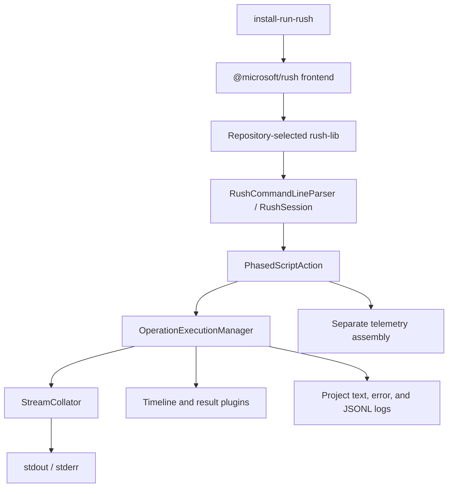
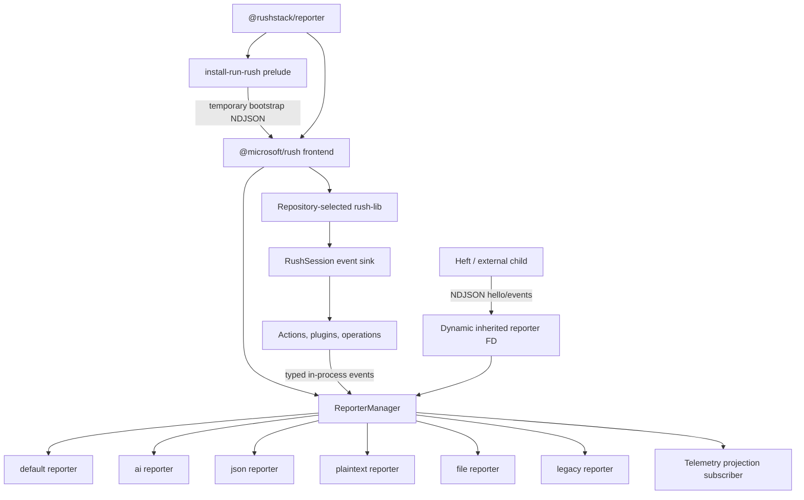

# Rush Reporter Overhaul Technical Design Document / RFC

| Document Metadata | Details |
| --- | --- |
| Author(s) | Sean Larkin |
| Status | In Review (RFC) |
| Team / Owner | Rush team |
| Created / Last Updated | 2026-07-12 |
| Tracking Issue | [#5858 — Rush Reporter Overhaul](https://github.com/microsoft/rushstack/issues/5858) |

## 1. Executive Summary

Rush currently emits presentation strings from its bootstrap, frontend,
command parser, operation scheduler, plugins, and child processes. This makes
output verbose, difficult to adapt for terminals, CI, and agents, and unable to
provide a consistent structured error or remediation contract.

This RFC introduces `@rushstack/reporter`, a public beta package containing the
canonical event protocol, reporter manager, and built-in reporters. Rush-owned
code emits presentation-free structured events through a scoped sink.
Reporters independently render concise interactive output, append-only
plaintext, versioned JSON, bounded AI output, full-detail files, or the legacy
format. Reporting initializes before repository `rush-lib` loads, supports
multiple destinations, and uses a negotiated NDJSON channel across process
boundaries.

The default interactive build occupies at most a three-row live region, while
every invocation retains a detailed local log. The migration ships structured
events in shadow mode, adds opt-in reporters, and changes defaults only in the
Rush daemon-aligned major release.

## 2. Context and Motivation

This proposal implements the direction documented in
[the #5858 codebase research](../research/tickets/2026-07-12-5858-rush-reporter-overhaul.md)
and
[the design review record](../research/notes/2026-07-12-rush-reporter-design-review.md).

### 2.1 Current State

Rush output crosses three separately reporting layers:

1. `install-run-rush` selects and installs `@microsoft/rush`.
2. The `@microsoft/rush` frontend selects the repository-requested
   `rush-lib`.
3. The selected `rush-lib` parses commands and executes operations.

The current output path uses direct `console.*` calls,
`@rushstack/terminal`, `StreamCollator`, fixed summarizer plugins, per-project
logs, `AlreadyReportedError`, and a separate telemetry assembly path. The
current architecture is documented in
[Rush output pipeline research](../research/docs/2026-07-12-rush-output-pipeline.md)
and
[operation reporting research](../research/docs/2026-07-12-rush-operation-reporting.md).



### 2.2 The Problem

- **Human impact:** Default builds emit large, scrolling output with limited
  compact liveness information.
- **Agent impact:** Verbose output consumes context, while errors lack stable
  codes, structured remediation, and deterministic log handoff.
- **CI impact:** Current presentation is coupled to the operation scheduler
  rather than selected for CI, TTY, pipe, or machine consumers.
- **Plugin impact:** Plugins write through terminal abstractions and can depend
  on presentation behavior.
- **Compatibility impact:** Output begins before repository `rush-lib` loads,
  so a reporter initialized only inside `rush-lib` cannot own the complete
  session.
- **Technical debt:** The print-then-throw `AlreadyReportedError` pattern
  encodes presentation state into control flow.

## 3. Goals and Non-Goals

### 3.1 Functional Goals

- [ ] Create `@rushstack/reporter` as a public beta package containing the
      event contracts, wire protocol, reporter manager, and built-in reporters.
- [ ] Initialize reporting in a two-stage bootstrap before repository
      `rush-lib` loads.
- [ ] Emit a canonical presentation-free event stream from Rush-owned code.
- [ ] Support simultaneous reporters with exclusive destination ownership.
- [ ] Provide built-in `default`, `ai`, `json`, `plaintext`, `file`, and
      `legacy` reporters.
- [ ] Reduce interactive default output to a three-row live region.
- [ ] Preserve a full-detail invocation log and existing per-project logs.
- [ ] Provide versioned structured diagnostics with stable codes and
      remediation.
- [ ] Preserve raw child-process stdout/stderr and recover diagnostics through
      tested problem matchers.
- [ ] Support current and future Heft versions without requiring lockstep
      rollout.
- [ ] Preserve command success semantics and command-specific JSON schemas.

### 3.2 Non-Goals

- [ ] Do not redesign operation scheduling, parallelism, or cobuild.
- [ ] Do not add translated locales in v1.
- [ ] Do not load third-party reporter implementations in v1.
- [ ] Do not add full reporter CLI support to `rushx` or reinterpret
      `rush-pnpm` output.
- [ ] Do not make native Heft structured reporting block Rush reporter v1.
- [ ] Do not introduce category-mapped exit codes in v1.
- [ ] Do not make Markdown a streaming transport or ship porcelain before a
      concrete consumer requires it.

## 4. Proposed Solution

### 4.1 System Architecture



### 4.2 Architectural Pattern

The design uses a publisher-subscriber event architecture:

- Rush-owned producers publish immutable structured events.
- `ReporterManager` assigns session ordering and fans events out to subscribers.
- Each reporter owns presentation, filtering, and one exclusive destination or
  destination group.
- Telemetry is a non-presentation subscriber that consumes an allowlisted
  projection before reporter filtering.
- Cross-process producers use a negotiated NDJSON adapter for the same semantic
  event model.

### 4.3 Key Components

| Component | Responsibility | Location |
| --- | --- | --- |
| `@rushstack/reporter` | Contracts, event types, manager, wire adapters, and built-in reporters | New package |
| Bootstrap prelude | Parse early controls and buffer Rush-owned startup events | `install-run-rush` |
| Frontend reporter host | Create the authoritative manager before version selection | `apps/rush` |
| Event sink | Provide scoped producer APIs without exposing reporter instances | `rush-lib` / future Heft |
| Wire adapter | Exchange negotiated NDJSON on an inherited descriptor | `@rushstack/reporter` |
| Compatibility adapters | Bridge old engines, legacy renderer, telemetry, and sentinel errors | `apps/rush` / `rush-lib` |
| Problem matcher registry | Recover structured diagnostics from raw child output | `rush-lib` / Heft integrations |

## 5. Detailed Design

### 5.1 Package Boundary

`@rushstack/reporter` contains:

- public beta TypeScript contracts;
- core event and diagnostic DTOs;
- reporter lifecycle and manager;
- protocol version and capability types;
- typed in-process sink;
- NDJSON encoder, decoder, and handshake;
- built-in `default`, `ai`, `json`, `plaintext`, `file`, and `legacy`
  reporters;
- English resource keys and templates for Rush-owned reporter presentation.

It must not depend on `rush-lib`. `rush-lib` and future Heft versions depend on
it to emit events. `@rushstack/terminal` remains a low-level utility but is not
the canonical producer contract.

The committed zero-dependency `install-run-rush` bundle does not import the
package at runtime. Its build embeds only a minimal frozen bootstrap envelope
encoder and protocol-major constant generated from `@rushstack/reporter`.

Third-party reporter loading is deferred. Namespaced extension events are
public beta in v1, but only built-in reporters are instantiated.

### 5.2 Canonical Event Contract

```ts
export interface IReporterProtocolVersion {
  major: number;
  minor: number;
}

export type ReporterPrivacyClassification =
  | 'public'
  | 'local-sensitive'
  | 'secret';

export interface IReporterEventEnvelope<TPayload> {
  protocolVersion: IReporterProtocolVersion;
  eventId: string;
  sessionId: string;
  parentSessionId?: string;
  parentOperationId?: string;
  sequence: number;
  sourceSequence?: number;
  timestamp: string;
  source: {
    packageName: string;
    packageVersion: string;
    component?: string;
  };
  scope?: {
    commandName?: string;
    operationId?: string;
    projectName?: string;
    phaseName?: string;
  };
  privacy: ReporterPrivacyClassification;
  required: boolean;
  type: ReporterEventType;
  payload: TPayload;
}
```

`sequence` is authoritative for ordering. `timestamp` is informational.
Events are immutable and JSON-serializable. JavaScript `Error` instances are
never serialized directly.

For child sessions, `ReporterManager` assigns the global `sequence` in receipt
order and preserves the producer's local sequence as `sourceSequence`.

The closed core union includes:

- `sessionStarted`, `sessionCompleted`;
- `commandStarted`, `commandCompleted`;
- `operationRegistered`, `operationStatusChanged`;
- `activityChanged`, `watchCycleCompleted`;
- `diagnosticEmitted`;
- `externalProcessStarted`, `externalOutput`, `externalProcessCompleted`;
- `artifactAvailable`;
- `commandResult`;
- `extension`.

Extension events use namespaced beta identifiers and JSON-serializable payloads.
Core lifecycle event creation remains controlled by Rush.

### 5.3 Producer API

Reporter implementations and destinations are never exposed to producers.

```ts
export interface IReporterEventSink {
  emit<TPayload>(
    event: Omit<IReporterEventEnvelope<TPayload>, 'eventId' | 'sequence' | 'timestamp'>
  ): string;
}

export interface IScopedReporter {
  emitMessage(options: IScopedMessageOptions): string;
  emitDiagnostic(diagnostic: IRushDiagnostic): string;
  emitExtension<TPayload>(name: string, payload: TPayload): string;
}
```

`RushSession` exposes scoped reporter/logger creation. Actions receive the same
sink through execution context. Plugins cannot inspect active modes,
destinations, or thresholds.

The breaking major removes `ILogger.terminal` and
`RushSession.terminalProvider`. Plugin manifests declare the supported Rush
plugin API version. Incompatible plugins fail before `apply()` with a
structured migration diagnostic.

### 5.4 Reporter Lifecycle and Fan-Out

```ts
export interface IReporter {
  readonly name: string;
  initializeAsync(context: IReporterContext): Promise<void>;
  report(event: IReporterEventEnvelope<unknown>): void;
  flushAsync(): Promise<void>;
  closeAsync(): Promise<void>;
}
```

`ReporterManager`:

- assigns one monotonic session sequence;
- uses one ordered asynchronous queue per reporter;
- enforces exclusive destination ownership;
- permits shared output only through an explicit multiplexer;
- flushes for normal and error completion with a 10-second timeout;
- performs best-effort signal flush with a 2-second timeout;
- coalesces replaceable UI status events under pressure;
- never drops lifecycle, diagnostic, result, artifact, or external-output
  events.

Explicit reporter initialization failures are fatal. Runtime failure disables
an optional reporter and emits one emergency stderr diagnostic. Failure of a
required parent/wire reporter is fatal. Failure to create the full-detail file
at both repository and OS-temp paths is nonfatal but emits an emergency warning
and marks the artifact unavailable.

### 5.5 Bootstrap and Wire Protocol

`install-run-rush` performs a minimal prelude:

1. Parse early reporter controls.
2. Encode up to 1 MiB of structured bootstrap events using the bundled minimal
   envelope encoder.
3. Preserve inherited npm output as raw external output.
4. Write the bounded events to a temporary NDJSON handoff file.
5. Pass the file path to the installed frontend using a private environment
   variable.

The `@microsoft/rush` frontend creates `ReporterManager` before version
selection, replays the bootstrap file, and deletes it. The selected `rush-lib`
receives a typed sink and does not own selection.

A direct `rush` invocation starts at the frontend and does not use the handoff
file. Abandoned handoff files are cleaned using the OS-temp fallback retention
policy.

If the bootstrap buffer fills, required and diagnostic events are preserved.
Replaceable status events may be coalesced or discarded, and replay includes a
`bufferTruncated` event describing the loss. A required event that cannot be
preserved fails the bootstrap.

Cross-process producers use NDJSON on a dynamically allocated inherited file
descriptor. The descriptor number is communicated using a private environment
variable. stdout and stderr remain normal process streams.

```ts
interface IReporterHello {
  kind: 'hello';
  protocolVersion: IReporterProtocolVersion;
  producerVersion: string;
  capabilities: string[];
  requiredFeatures: string[];
}

interface IReporterHelloAck {
  kind: 'helloAck';
  protocolVersion: IReporterProtocolVersion;
  acceptedCapabilities: string[];
  rejectedRequiredFeatures: string[];
}
```

Protocol rules:

- Support the current protocol major.
- Minor versions are additive.
- Events and capabilities default to optional.
- Producers mark only correctness-critical semantics as required.
- Unknown optional events are ignored or retained in full-detail output.
- Unknown required features or unsupported majors produce an update-global-Rush
  diagnostic.
- Explicit unsupported reporter requests fail.
- Automatic selection may safely fall back to legacy/plaintext behavior.

Limits:

- bootstrap buffer: 1 MiB;
- NDJSON record: 1 MiB;
- raw external-output chunk: 64 KiB.

### 5.6 Reporter Configuration

Public controls:

```text
--reporter <default|ai|json|plaintext|file|legacy>
--log-level <quiet|normal|verbose|debug>
--output <reporter>://<target>?key=value
```

Examples:

```text
rush build --reporter=plaintext
rush build --reporter=json --output=file://./rush-debug.log?logLevel=debug
rush build --output=json://./rush-events.jsonl
```

Environment controls:

- `RUSH_REPORTER`;
- `RUSH_LOG_LEVEL`;
- `COPILOT_CLI`;
- configured agent environment names from `rush.json`.

```json
{
  "reporting": {
    "agentEnvironmentVariables": ["MY_AGENT_CLI", "ANOTHER_AGENT"]
  }
}
```

An agent variable is active when defined and not equal, case-insensitively, to
an empty string, `0`, `false`, `no`, or `off`.

Precedence:

1. Explicit CLI controls.
2. `RUSH_REPORTER` / `RUSH_LOG_LEVEL`.
3. Agent detection (`COPILOT_CLI` plus configured variables).
4. CI detection (`CI` plus known vendor variables).
5. Interactive TTY.
6. Generic non-TTY plaintext.

Legacy flags remain permanent compatibility aliases for the primary reporter:

- `--quiet` maps to `quiet`;
- `--verbose` maps to `verbose`;
- `--debug` maps to `debug`;
- contradictory verbosity controls are rejected.

Command-specific `--json` behavior remains unchanged and is not an alias for
`--reporter=json`.

### 5.7 Log Levels

Each reporter independently applies:

1. `quiet` — failures, required warnings, and final result;
2. `normal` — standard lifecycle, progress, diagnostics, and result;
3. `verbose` — detailed operation and external process activity;
4. `debug` — verbose plus protocol, cache, internal, and stack details.

Event diagnostic severity remains separate from reporter log level. The
full-detail file reporter defaults to `debug`.

### 5.8 Automatic Reporter Matrix

| Environment | Primary reporter | Additional reporter |
| --- | --- | --- |
| Agent detected | `ai` | `file` |
| Recognized CI | detailed `plaintext` | `file` |
| Interactive TTY | `default` | `file` |
| Other non-TTY | concise `plaintext` | `file` |

Machine reporters own stdout exclusively. Their stdout contains payload records
only; human progress and emergency diagnostics use stderr or files.

`rushx` and `rush-pnpm` receive no public reporter flags in phase 1.
`rush-pnpm --reporter` remains pnpm's option. Rush-owned bootstrap chatter may
be suppressed in machine modes, and only private child context is propagated.

### 5.9 Default Interactive Reporter

The interactive reporter uses a maximum three-row live region:

1. aggregate phase/progress and spinner;
2. width-aware active projects with `+N more`;
3. latest activity, liveness, or result.

Requirements:

- refresh at no more than 10 Hz;
- react to terminal resize;
- restore cursor state on success, failure, cancellation, and signal;
- successful completion leaves no more than three stable lines;
- failure may append a bounded diagnostic block and log path;
- watch mode keeps the live region and appends one summary per completed cycle.

Color follows TTY capability while honoring `NO_COLOR` and `FORCE_COLOR`. No
new global color flag is introduced.

### 5.10 Plaintext and Non-TTY Reporter

Plaintext is append-only, has no cursor movement, and disables color by default.
It is human-readable but not a parsing contract.

Long-running non-TTY and CI sessions emit a compact heartbeat every 30 seconds,
in addition to start, meaningful state changes, diagnostics, and final result.
The detailed CI mode retains StreamCollator-like operation grouping.

### 5.11 JSON and AI Reporters

The stable JSON reporter emits the complete versioned NDJSON event stream.

The AI reporter is a versioned public beta bounded projection. It emits status
and final records containing:

- result and exit code;
- operation/project scope;
- error codes and categories;
- structured remediation;
- aggregate counts;
- primary log path and format;
- artifact completeness.

Limits:

- at most 64 KiB per invocation;
- at most 20 detailed diagnostics;
- when failures exist, warnings are represented by counts and references;
- warning-only success may include bounded warning details;
- raw logs and stacks are excluded by default.

Absolute log paths are local reporter output and never enter telemetry.
Automatic agent selection is enabled only after deterministic corpus
evaluations pass. Offline model evaluation may supplement but never gate
network-dependent CI.

Markdown remains experimental and post-run only. Porcelain is deferred.

### 5.12 Full-Detail File Reporter

Every invocation attempts to write:

```text
<commonTempFolder>/rush-logs/<UTC timestamp>-<pid>-<action>.log
```

`latest.log` points to or copies the latest successfully written invocation log
according to platform capability, regardless of whether the Rush command
succeeded or failed. Before configuration loads, the reporter buffers events
and may use an OS-temp fallback.

The invocation log:

- runs at `debug`;
- preserves ordered external stdout/stderr;
- excludes structured fields classified as `secret`;
- uses owner-only permissions where supported;
- documents that raw child output cannot be reliably redacted.

Existing project merged, error-only, and chunk JSONL logs remain unchanged
initially because cache replay and bounded summaries depend on them.

Retention:

- delete invocation files older than 14 days;
- retain at most 20 sessions per repository;
- apply the same 14-day policy and a 20-session per-user cap to OS-temp fallback
  files;
- `rush purge` removes the directory.

### 5.13 StreamCollator Replacement

The operation scheduler emits raw semantic events:

- operation registration;
- status transitions;
- output chunks;
- completion;
- aggregate command result.

The concise reporter derives current activity without buffering project output.
The detailed plaintext and file reporters own grouping and buffering equivalent
to current StreamCollator behavior. Problem matchers receive the same
uncollated source stream.

`@rushstack/stream-collator` is removed from the primary Rush output path after
parity tests pass. Package removal is a later cleanup.

### 5.14 Structured Diagnostics

```ts
export type RushDiagnosticCategory =
  | 'configuration'
  | 'input'
  | 'dependency-tool'
  | 'environment'
  | 'network-auth'
  | 'operation'
  | 'internal';

export interface IRushDiagnostic {
  diagnosticId: string;
  code: string;
  category: RushDiagnosticCategory;
  severity: 'warning' | 'error';
  summaryKey: string;
  detailKey?: string;
  parameters?: Record<string, IClassifiedDiagnosticValue>;
  remediation?: IRushRemediationAction[];
  source?: IRushDiagnosticSource;
  causeDiagnosticIds?: string[];
  retryable?: boolean;
  relatedArtifactIds?: string[];
}
```

Codes use a central permanent never-reused registry:

```text
RUSH_<DOMAIN>_<NAME>
```

English templates are keyed by code and resource key. Remediation actions may
include:

- a command;
- a documentation URL;
- a safety classification indicating whether automated execution is safe.

Diagnostic emission returns a diagnostic ID. Propagated failures reference
that ID. Catch boundaries emit only failures not already represented.

Unexpected programmer failures produce a stable internal-error code and log
pointer. Stack traces appear only in debug/full-detail output.

Fields are classified individually as `public`, `local-sensitive`, or
`secret`. Field-level classification is authoritative. The envelope-level
privacy classification is the minimum classification floor for every field in
that event. Reporters enforce destination policy; telemetry uses a separate
allowlist.

An internal `RushError` may wrap a diagnostic DTO in-process, but the DTO is the
wire contract.

### 5.15 `AlreadyReportedError`

New usage is prohibited when structured diagnostic APIs become available.
A compatibility bridge correlates legacy sentinels with previously emitted
diagnostics and suppresses duplicate rendering.

The bridge is removed in a later major after:

- zero first-party usages remain;
- plugin API migration guidance is published;
- ecosystem notice and migration time are provided.

### 5.16 External Output and Problem Matchers

External stdout/stderr is preserved losslessly as ordered chunks. ANSI-normalized
text is processed separately by tool- and version-scoped problem matchers.

Matchers:

- never modify raw output or process status;
- emit linked diagnostics without replacing evidence;
- require high-confidence corpus tests before default enablement;
- cap duplicate diagnostics;
- preserve unmatched text.

Older Heft versions use this path.

### 5.17 Telemetry

Telemetry subscribes to canonical events before reporter filtering and produces
an allowlisted aggregate at command completion.

Allowed fields:

- command and result;
- duration and aggregate operation timing;
- operation status counts;
- diagnostic codes and categories;
- selected reporter mode;
- protocol and producer versions.

Excluded fields:

- messages and templates;
- paths;
- raw stdout/stderr;
- command arguments;
- remediation parameters;
- stack traces;
- local-sensitive and secret values.

The existing `beforeLog` hook is preserved through an adapter during migration.

### 5.18 Exit Codes

- success, including warning-only success: `0`;
- Rush or operation failure: `1`;
- logical cancellation/aborted command: `1`;
- OS signal termination: conventional signal-derived status.

Reporters and diagnostic categories never select exit codes.

### 5.19 Heft Integration

The shared protocol is Heft-capable in P0, but native Heft emission does not
block Rush v1.

- Older Heft versions continue through raw streams and problem matchers.
- A future Heft breaking major depends on `@rushstack/reporter`.
- Heft evolves `LoggingManager` and `ScopedLogger` into structured emitters.
- Rush passes a dynamic descriptor and correlates child events using child
  session ID, parent session ID, and parent operation ID.
- If descriptor negotiation is unavailable, Heft falls back to normal
  stdout/stderr.
- Standalone future Heft uses the same explicit, agent, CI, TTY, and non-TTY
  selection model.

## 6. Alternatives Considered

| Option | Advantages | Disadvantages | Decision |
| --- | --- | --- | --- |
| Keep reporters in `rush-lib` | Fewer packages | Cannot own bootstrap output; wrong dependency direction | Rejected |
| Extend only `@rushstack/terminal` | Reuses providers | Terminal chunks lack lifecycle and diagnostic semantics | Rejected |
| Serialize NDJSON in-process | One transport implementation | Unnecessary hot-path allocation and parsing | Rejected |
| Keep StreamCollator before reporters | Low migration cost | Scheduling remains coupled to presentation | Rejected |
| One composite reporter | Simple destination handling | Prevents independent levels and destinations | Rejected |
| Upload the complete event stream as telemetry | Maximum detail | Privacy, volume, and presentation coupling risks | Rejected |
| Manifest-only log handoff | Avoids duplicate output | Harder for users and agents to consume one narrative | Rejected |
| Big-bang major rewrite | Short transition | High compatibility and diagnosis risk | Rejected |

## 7. Cross-Cutting Concerns

### 7.1 Security and Privacy

- Structured fields carry field-level privacy classifications.
- `secret` structured fields never reach local full logs.
- Invocation logs use owner-only permissions where supported.
- Raw child output is preserved and may contain sensitive tool output; this is
  documented because pattern redaction is not reliable.
- Machine stdout contains payload only.
- Telemetry is allowlist-only and excludes paths, text, raw streams, and stacks.
- Third-party reporter loading is deferred, avoiding a new v1 code-loading
  trust boundary.

### 7.2 Observability

The reporter subsystem records local debug information for:

- selected reporters and selection reason;
- protocol negotiation and fallback;
- disabled reporter failures;
- queue pressure and coalesced status events;
- file reporter location and completeness;
- matcher identity and emitted diagnostic IDs.

These local details are not automatically telemetry fields.

### 7.3 Performance and Capacity

Blocking budgets:

- no more than 3% representative-build wall-time regression;
- no more than 32 MiB additional peak memory;
- interactive refresh no more than 10 Hz;
- bounded streaming rather than whole-build buffering;
- no loss of lifecycle, diagnostics, results, artifacts, or external output;
- AI output capped at 64 KiB and 20 detailed diagnostics.

Lazy payload construction is not part of P0. It is introduced only if profiling
shows material producer-side cost.

### 7.4 Reliability

- Reporter queues preserve per-reporter order.
- Required wire failure is fatal.
- Optional reporter failure is isolated.
- Explicit incompatible reporter requests fail.
- Automatic selection may fall back safely and records the reason in the
  detailed log.
- Full-detail file failure does not fail a build.

## 8. Migration, Rollout, and Testing

### 8.1 Migration Phases

1. **Contracts and baselines**
   - Publish `@rushstack/reporter`.
   - Freeze legacy output snapshots.
   - Add protocol and compatibility goldens.
2. **Bootstrap and compatibility adapters**
   - Add two-stage initialization.
   - Support new frontend/old engine and old frontend/new engine fallback.
   - Keep legacy rendering as the sole visible output.
3. **Shadow structured emission**
   - Emit first-party lifecycle and diagnostic events without changing output.
   - Validate telemetry and exit-code parity.
4. **Opt-in reporters**
   - Add `file`, `plaintext`, `json`, `default`, and `ai`.
   - Expose CLI opt-in and an experimental repository setting.
   - Replace StreamCollator only when a new reporter path is enabled.
5. **Heft protocol track**
   - Support negotiated child descriptors.
   - Continue raw-stream compatibility for older Heft.
6. **Daemon-aligned major default flip**
   - Enable environment-based automatic selection.
   - Remove legacy terminal APIs and fail incompatible plugins before `apply()`.
   - Retain the legacy renderer, aliases, and sentinel bridge.
7. **Later cleanup major**
   - Remove the legacy renderer after at least one full major of default use,
     no blocking canary regressions, and documented migration.
   - Remove the `AlreadyReportedError` bridge after ecosystem criteria are met.

Every phase must be independently releasable and revertible.

### 8.2 Rollout Controls

- Pre-major exposure: explicit CLI plus an experimental repository setting.
- Agent auto-selection: enabled only after deterministic AI corpus gates pass.
- Default flip: Rush daemon-aligned major release.
- Emergency fallback: `RUSH_REPORTER=legacy` for at least one major.
- Legacy verbosity aliases remain permanent documented compatibility aliases.

### 8.3 Test Plan

#### Protocol and API

- Golden event envelope and diagnostic schema tests.
- hello/ack capability negotiation tests.
- current-major/minor compatibility tests.
- unknown optional and required event behavior.
- NDJSON record, chunk, and buffer limit tests.
- bootstrap handoff-file replay, deletion, truncation-marker, and required-event
  overflow tests.
- parent/child receipt ordering and `sourceSequence` preservation tests.

#### Cross-Version Compatibility

- new frontend + new engine;
- new frontend + old engine adapter;
- old frontend + new engine fallback;
- unsupported explicit reporter failure;
- automatic fallback behavior;
- old and new Heft descriptor paths.

#### Reporter Behavior

- stable plaintext snapshots;
- normalized semantic snapshots for dynamic TTY output;
- resize, width, color, heartbeat, and cursor restoration;
- watch-cycle summaries;
- stdout-purity tests for JSON and AI;
- full-log path, permissions, retention, and flush completeness;
- `latest.log` behavior for successful and failed commands;
- OS-temp fallback cleanup;
- optional and required reporter failure isolation.

#### Diagnostics and External Tools

- exactly-once diagnostic rendering;
- central code registry validation;
- privacy classification and redaction;
- internal-error stack visibility;
- ANSI, split-chunk, malformed-output, and matcher corpus tests;
- duplicate matcher caps.

#### Telemetry

- allowlist schema tests;
- proof that paths, messages, raw streams, stacks, and remediation parameters do
  not escape;
- current telemetry parity through the adapter.

#### Performance

- representative Rush build benchmarks against the 3% / 32 MiB budgets;
- queue pressure and status coalescing;
- full-log streaming without unbounded allocation.

#### AI Evaluation

- deterministic corpus asserting stable codes, remediation, bounded output,
  root-cause ordering, and valid flushed log paths;
- supplementary offline model evaluation;
- no network-dependent model evaluation in CI.

## 9. Open Questions / Unresolved Issues

No blocking design questions remain from the specification wizard.

The following are explicitly deferred rather than unresolved:

- third-party reporter loading;
- translated locales and pluralization;
- stable Markdown and porcelain contracts;
- full reporter support for `rushx`;
- category-mapped exit codes;
- removal of existing per-project logs;
- removal of the `@rushstack/stream-collator` package itself.
