# Playwright Local Browser Server VS Code Extension

Enables running Playwright tests in a remote VS Code environment (such as GitHub Codespaces) while launching and driving the actual browser process on your local machine.

This extension is a UI wrapper around the tunneling/runtime library [`@rushstack/playwright-browser-tunnel`](../../apps/playwright-browser-tunnel). It starts/stops the local browser host process and forwards Playwright's WebSocket traffic between the remote test runner and your local browser.

## Getting Started

Before running your Playwright tests in a remote environment, you must first start the browser tunnel:

1. Open the VS Code **Command Palette** (`Ctrl+Shift+P` or `Cmd+Shift+P` on macOS)
2. Search for and run **"Playwright: Start Playwright Browser Tunnel"**
3. The tunnel will begin polling for connections from your remote environment
4. Now you can run your Playwright tests in the remote workspace

To stop the tunnel, open the Command Palette and run **"Playwright: Stop Playwright Browser Tunnel"**.

### Requirements

This extension requires VS Code's terminal shell integration to be enabled. Ensure the following setting is enabled in your VS Code settings:

```json
"terminal.integrated.shellIntegration.enabled": true
```

This is typically enabled by default, but if you have explicitly disabled it, the extension will not work correctly.

### Auto-starting the tunnel

If you want the browser tunnel to start automatically when VS Code opens, you can add the following to your workspace settings (`.vscode/settings.json`):

```json
{
  "playwright-local-browser-server.autoStart": true
}
```

> **Security note:** Auto-start is disabled by default because the tunnel allows a remote environment to launch browser processes on your local machine. Only enable auto-start for workspaces you trust.

## How it works

- Remote side (Codespace): your Playwright test fixture starts a WebSocket **tunnel server** on a well-known port (default `56767`) and a small local HTTP endpoint used by the Playwright client.
- Local side (your VS Code UI machine): this extension starts a `PlaywrightTunnel` in `poll-connection` mode and connects to the forwarded tunnel port.
- After a handshake (browser type, launch options, Playwright version), the extension installs the requested Playwright/browser as needed, launches a local `browserServer`, and begins bidirectional forwarding.

## Test fixture requirement

For this extension to work, your Playwright tests must use a custom fixture that starts the tunnel server on the remote side.

Use `tunneledBrowser()` from `@rushstack/playwright-browser-tunnel` inside your fixture’s `browser` override (so that the Playwright client in the remote environment connects through the tunnel).

Reference implementation: [apps/playwright-browser-tunnel/tests/testFixture.ts](../../apps/playwright-browser-tunnel/tests/testFixture.ts)

Example:

```ts
import { test as base } from '@playwright/test';
import { tunneledBrowser } from '@rushstack/playwright-browser-tunnel';

export const test = base.extend({
	browser: [
		async ({ browserName, launchOptions, channel, headless }, use) => {
			await using tunnel = await tunneledBrowser(browserName, {
				channel,
				headless,
				...launchOptions
			});

			await use(tunnel.browser);
		},
		{ scope: 'worker' }
	]
});
```

## How `extensionIsInstalled()` works with this extension

To help remote test code detect whether this extension is installed/active, the extension writes a marker file named `.playwright-local-browser-server-extension-installed.txt` into the remote environment’s `os.tmpdir()` when VS Code is connected to a remote workspace.

On the test (remote) side, you can call `extensionIsInstalled()` from `@rushstack/playwright-browser-tunnel`, which simply checks for that marker file:

```ts
import { extensionIsInstalled } from '@rushstack/playwright-browser-tunnel';

if (!(await extensionIsInstalled())) {
	throw new Error(
		'Playwright Local Browser Server VS Code extension not detected. Install/enable it and ensure VS Code is connected to the remote workspace.'
	);
}
```

## Full Sequence Diagram

```mermaid
sequenceDiagram
	participant PT as Playwright Tests
	participant BF as Browser Fixture
	participant TS as Tunnel Server (WebSocket)
	participant HS as HTTP Server
	participant VSC as VS Code Extension
	participant BS as Browser Server
	participant LB as Local Browser

	Note over PT,LB: Context:  Enables local browser testing for remote VS Code environments (e.g., Codespaces)

	PT->>BF:  Trigger custom browser fixture

	par Fixture Setup
		BF->>HS: Launch localhost HTTP server
		BF->>TS: Launch WebSocket tunnel server (well-known port)
	end

	BF->>HS: browser.connect('http://localhost:<port>? browser=chromium&launchOptions={}')

	loop Polling
		VSC->>TS: Poll for connection (well-known port)
	end

	TS-->>VSC: WebSocket connection established

	BF->>VSC: Send handshake (browser type, launchOptions, Playwright version)

	VSC->>VSC: Install requested Playwright version
	VSC->>VSC: Install requested browser

	VSC->>BS: Launch browserServer via Playwright API
	BS->>LB: Start local browser instance

	VSC->>BS: Create WebSocket client connection

	VSC->>TS: Send acknowledgement (ready to go)

	par Setup Forwarding
		Note over BF,TS:  Fixture:  PT ↔ Tunnel Server
		Note over VSC,BS: Extension: Tunnel Server ↔ Browser Server
	end

	BF->>BF:  Flush buffered messages from test

	rect rgb(200, 230, 200)
		Note over PT,LB:  Transparent bidirectional communication established
		PT->>BF:  Playwright commands
		BF->>TS: Forward to tunnel
		TS->>VSC: Forward to extension
		VSC->>BS: Forward to browser server
		BS->>LB: Execute in local browser
		LB-->>BS: Response
		BS-->>VSC: Forward response
		VSC-->>TS: Forward to tunnel
		TS-->>BF: Forward to fixture
		BF-->>PT: Return to test
	end

	Note over PT,LB: 🎉 Profit!  Local browser available to remote tests transparently
```



## Commands

This extension contributes the following commands:

- **Playwright: Start Playwright Browser Tunnel** (`playwright-local-browser-server.start`)
- **Playwright: Stop Playwright Browser Tunnel** (`playwright-local-browser-server.stop`)
- **Playwright Local Browser Server: Manage Launch Options Allowlist** (`playwright-local-browser-server.manageAllowlist`)
- **Playwright Local Browser Server: Show Log** (`playwright-local-browser-server.showLog`)
- **Playwright Local Browser Server: Show Settings** (`playwright-local-browser-server.showSettings`)
- **Playwright Local Browser Server: Show Tunnel Menu** (`playwright-local-browser-server.showMenu`) — status bar menu

## Settings

- `playwright-local-browser-server.autoStart` (default: `false`) — automatically starts the tunnel when the extension activates.
- `playwright-local-browser-server.promptBeforeLaunch` (default: `true`) — show a confirmation prompt before launching the browser server with the requested launch options. This helps protect against potentially malicious launch options from compromised environments.
- `playwright-local-browser-server.tunnelPort` (default: `56767`) — port used by the remote tunnel server.

## Notes

- The extension currently connects to `ws://127.0.0.1:56767` on the local machine. In Codespaces, make sure the remote port is forwarded so it is reachable as `localhost` from your VS Code UI environment.
- For the underlying API and examples, see [`@rushstack/playwright-browser-tunnel`](../../apps/playwright-browser-tunnel).
